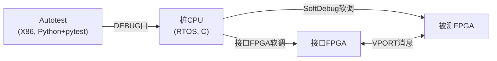
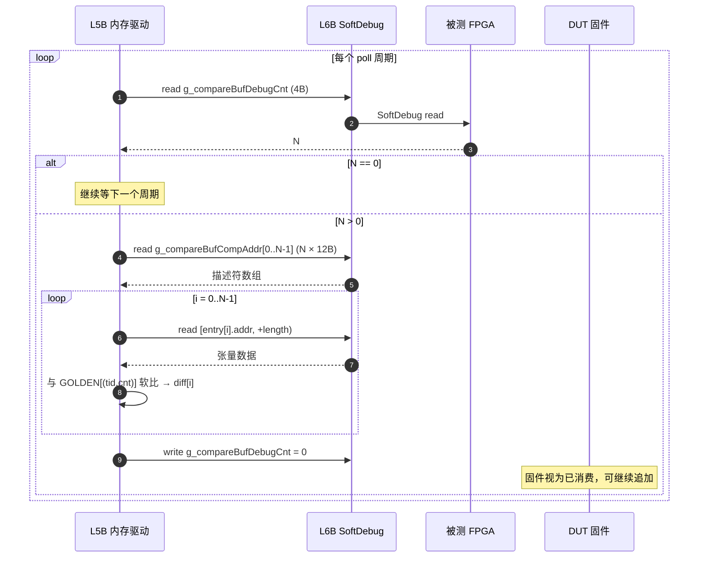
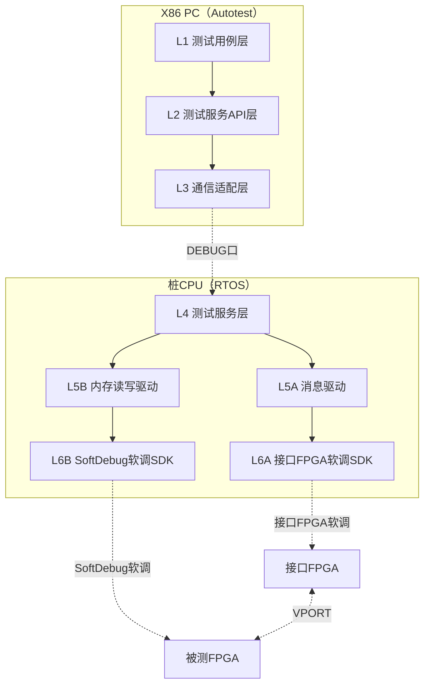
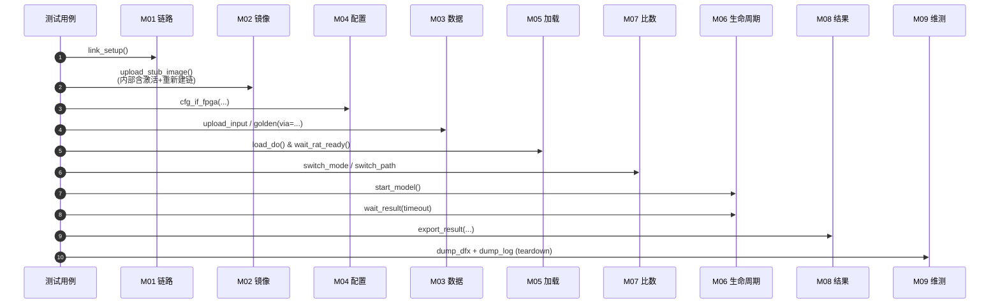
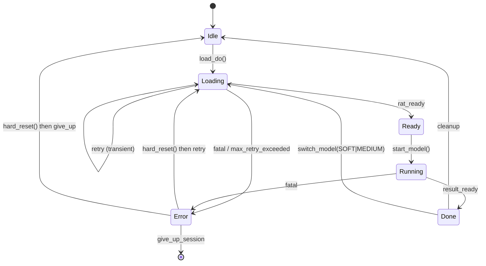
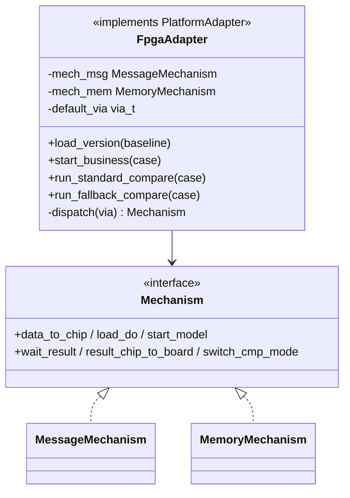
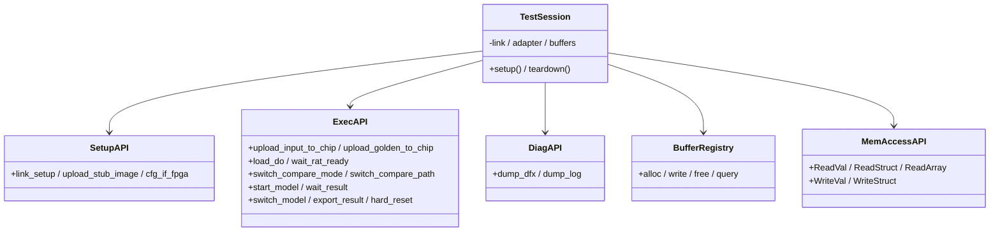
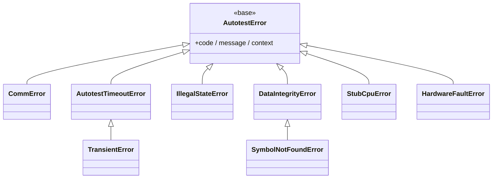

# 子 Wiki 6B：原型测试环境软件详细设计

> **文档定位**：FPGA 原型平台落地详设。覆盖 PC（Autotest）+ 桩 CPU（C/RTOS）+ FPGA 全栈，是 [子 wiki 6](./06_子wiki_Autotest软件架构.md) 多平台架构在 **FPGA 平台** 上的具体实现。
>
> **与上游 wiki 的分工**：
> - [01](./01_子wiki_版本制作与加载.md)：版本与基线
> - [02](./02_子wiki_中间结果软调.md)：比数模式与路径（端到端 / 阶段性 × 标准 / 备选）
> - [03](./03_子wiki_业务结果确认.md)：三态裁决 `Verdict = {PASS, WARN, FAIL}`
> - [04](./04_子wiki_DFX告警寄存器查询.md)：DFX 寄存器表与读清策略
> - [05](./05_子wiki_多执行平台架构扩展.md)：多平台需求与 PAL
> - [06](./06_子wiki_Autotest软件架构.md)：跨平台架构、PlatformAdapter 端口、pytest 主体
> - **本文档**：FPGA 平台**内部** —— 桩 CPU C 代码、A/B 双交互机制、buffer 管理、状态机
>
> **抽象层次（重要）**：本文档展开的 `Mechanism A/B`（消息 / 内存读写）是 **`FpgaAdapter` 的内部实现细节**。对上游能力服务层（06 § 3.2）不可见 —— 上游只看到 `PlatformAdapter`。
>
> **读者**：FPGA 平台的开发测试工程师。
>
> **本文档范围**：仅给设计骨架（架构图、模块表、流程时序、对齐表、设计决策）。具体接口签名、协议字段、代码示例由后续子文档逐步展开。

---

## 目录

0. [设计核心思想](#0-设计核心思想)
1. [L0 部署设计与交互机制](#1-l0-部署设计与交互机制)
2. [L1 软件模块设计](#2-l1-软件模块设计)
3. [L2 模块设计](#3-l2-模块设计)
4. [详细设计：接口与类](#4-详细设计接口与类)
5. [需求列表](#5-需求列表)
6. [工程实践约定](#6-工程实践约定)
7. [待澄清清单](#7-待澄清清单)
8. [附录](#附录)

---

## 0. 设计核心思想

> **使命**：把 FPGA 原型平台的硬件细节，封装为上游能力服务层可消费的稳定接口。

**五条公约：** (1) 模块只暴露能做什么，不暴露怎么做；(2) 用例不感知机制 A/B，专家用 `case.via=Via.X` 显式覆盖；(3) 可观测先于可调试 —— 每个动作 INFO 进出 + 耗时；(4) 幂等仅对查询 / 清理动作适用，状态变更动作由状态机拒绝非法重复；(5) 状态全用枚举 + 状态机，不靠约定俗成。

---

## 1. L0 部署设计与交互机制

### 1.1 物理拓扑



| 组件 | 形态 | 角色 |
|---|---|---|
| Autotest | X86 PC，Python + pytest | 用例编写、调度、判定、报告 |
| 桩 CPU | 单板嵌入式 RTOS，C | 暴露测试原语；桥接 PC ↔ 板上 FPGA |
| 接口 FPGA | FPGA | 被测系统外围模拟；提供 VPORT 消息引擎与比数引擎 |
| 被测 FPGA | FPGA | 承载 AI 模型计算的被测对象 |

### 1.2 通信通道矩阵

| 通道 | 端点 | 用途 |
|---|---|---|
| DEBUG 口 | Autotest ↔ 桩 CPU | 调用桩 CPU 函数、上下行数据 |
| 接口 FPGA 软调 | 桩 CPU → 接口 FPGA | 配置寄存器、控制消息引擎 |
| SoftDebug 软调 | 桩 CPU ↔ 被测 FPGA | 直接读写被测 FPGA 寄存器 / 片内 SRAM |
| VPORT 消息 | 接口 FPGA ↔ 被测 FPGA | 板上消息总线，承载激励与比数 |

### 1.3 两种交互机制（FpgaAdapter 内部）

被测 FPGA 上有两套用例执行框架，对应两种交互机制；用例按特性二选一。

| 机制 | 物理路径 | 启停 / 数据机制 | 适用 |
|---|---|---|---|
| **A 消息**（基于 VPORT）| 桩CPU → 接口FPGA → VPORT → 被测FPGA | VPORT 消息触发；接口 FPGA 定时器周期发数；硬件实时比数 + 高精度比数（DDR 序列） | 标准用例（90%+），数据需"二次加工"成消息引擎载荷 |
| **B 内存读写**（基于 SoftDebug）| 桩CPU → SoftDebug → 被测FPGA | 桩 CPU 写配置区，被测固件**周期轮询**触发执行；不支持硬件比，靠桩 CPU 软比 | 兜底用例 / 消息不通时定位；**前置硬约束**：被测固件必须提供配置区轮询入口（非无侵入兜底）|

### 1.4 机制选择与上游接口的映射

| 上游接口（06 § 4） | FpgaAdapter 内部分发 |
|---|---|
| `PlatformAdapter.load_version` | A 默认，B 兜底（消息通道不通时）|
| `PlatformAdapter.start_business` | A 默认 |
| `CompareExecutor.run_standard` | **机制 A** —— 接口 FPGA 比数引擎 |
| `CompareExecutor.run_fallback` | **机制 B** —— 桩 CPU 软比 |
| `case.via = Via.VIA_MSG / Via.VIA_MEM` | 强制走指定机制（绕开 adapter 默认）|

详见 § 4.2 `mechanism_ops_t` 分发表。

### 1.5 接口 FPGA 软调接口 — 机制 A 物理底座

> **关键性**：机制 A 的一切（上传数据、启动 DUT、控制定时器、读比数结果、触发高精度比数）**都通过接口 FPGA 软调实现**。L6A SDK 是机制 A 的根。

#### 1.5.1 寄存器空间布局

| 区域 | 用途 |
|---|---|
| GENERAL_CTRL | 全局开关、复位、版本号 |
| MSG_ENGINE | VPORT 消息引擎控制与状态 |
| TIMER_BANK | 定时器周期、使能、cycle 计数 |
| CMP_ENGINE | 比数引擎（标准路径）控制与实时结果 |
| HP_CMP | 高精度比数引擎 + DDR 序列指针 |
| DATA_BUF | 二次加工后载荷区 |
| RESULT_BUF | DUT 回传结果缓存 |
| DDR_WIN | 接口 FPGA DDR 访问窗口（含高精度序列）|

> 真实地址以硬件团队寄存器表为准。L6A SDK **绝不暴露地址**，只暴露语义化函数。

#### 1.5.2 L6A SDK API 分组

| 分组 | 职责 |
|---|---|
| 总控 | init / reset |
| 消息引擎 | VPORT 发送、轮询完成、收结果 |
| 定时器 | 周期注入数据控制 |
| 数据缓冲 | 二次加工后载荷读写 |
| 比数引擎 | 标准路径配置 / 拉结果 / 清零 |
| 高精度比数 | 序列预加载到 DDR / 触发 / 读详细报告 |
| DDR 访问 | 通用 DDR 窗口读写 |

> 具体 API 签名待后续子文档展开（依赖 Q-001 二次加工格式定型）。

#### 1.5.3 L5A ↔ L6A 协作

L5A 不直接碰寄存器 —— 所有硬件细节封装在 L6A 内。L5A 的"发数据 / 启动 DUT / 启用周期注入 / 等完成 / 配置比数 / 触发高精度"等动作，统一翻译为对 L6A 分组 API 的调用。**Setup 阶段** L5A 通过 L6A 把高精度比数序列预置进接口 FPGA DDR，运行期失败时仅触发引擎 fire，不再加载序列。

#### 1.5.4 抽象稳定性

软调硬件协议升级仅改 L6A 内部，L5A / L4 svc 无感。

### 1.6 机制 B 比数协议 — 被测固件内存契约

> **关键性**：机制 B 无硬件比数引擎，比数完全靠桩 CPU 通过 SoftDebug **轮询读取被测 FPGA 内存中的两个全局变量**完成。这两个变量是 L5B ↔ 被测固件之间的**唯一数据契约**。

#### 1.6.1 内存契约

被测固件必须在链接脚本固定地址处导出以下两个符号（地址由 [Q-009] 约定）：

| 符号 | 类型 | 含义 |
|---|---|---|
| `g_compareBufDebugCnt` | `UINT32` | 当前有效比数项数（0 = 无新数据，桩 CPU 继续轮询）|
| `g_compareBufCompAddr[200]` | `CompareEntryStru[200]` | 比数项数组（容量 200，消费整体清零后从头复用，详见 § 1.6.3）|

```c
typedef struct {
    UINT16 tid;         // 张量 / 阶段 ID
    UINT16 cnt;         // 同一 tid 的第几次产出（用于阶段性多轮）
    UINT32 length;      // 数据长度（字节）
    UINT64 addr;        // 数据起始地址（64 位 DUT 内存空间）
} CompareEntryStru;     // 固定 16 字节，alignof = 8（自然紧凑无 padding）
```

> 字段排列已自然紧凑无需 `__packed`；编译期用 `_Static_assert` 锁死 `sizeof == 16` 与 `_Alignof >= 8`。数组 `g_compareBufCompAddr` 用 `__attribute__((aligned(64)))` 保证首地址跨 cache line 安全；运行期可调 `COMPARE_BUF_SelfCheck()` 兜底校验。

> `addr` 指向 DUT 内存空间内的张量缓冲，桩 CPU 拿到后再发一次 SoftDebug 读，把 `[addr, addr+length)` 段拉回单板做软比。`g_compareBufCompAddr` 中**不内联数据**，仅存描述符。

#### 1.6.2 比数轮询时序



#### 1.6.3 生产 / 消费约定

- **生产侧（DUT 固件）**：每产出一项，**先填 `g_compareBufCompAddr[g_compareBufDebugCnt]` 全部 4 个字段，再以原子写递增 `g_compareBufDebugCnt`**。顺序颠倒会让桩 CPU 读到未初始化项。
- **消费侧（桩 CPU）**：处理完整批后**整体写 0 清 `g_compareBufDebugCnt`**（不做逐项消费），同时清空本地 batch；固件视为已消费缓冲区。
- **溢出**（固件待写第 201 项）：固件须触发 DFX 告警（详见 [04](./04_子wiki_DFX告警寄存器查询.md) 寄存器表），桩 CPU 检测到该告警即判 FAIL，不再继续轮询。
- **同 tid 多次产出**：阶段性比数中同一 tid 可能被多轮调用，用 `cnt` 区分；GOLDEN 须按 `(tid, cnt)` 二维索引（[03](./03_子wiki_业务结果确认.md) GOLDEN 命名约定同步覆盖）。

#### 1.6.4 与 L5B / M07 的协作

L5B 对外暴露语义化函数（绝不暴露 `g_compareBufDebugCnt` / `g_compareBufCompAddr` 地址），内部用 § 4.8 通用 API 实现：

| 函数 | 职责 | 内部展开 |
|---|---|---|
| `mem_drv_pull_compare_batch()` | 完整执行 § 1.6.2 时序，返回 `list[(entry, data)]` | `ReadVal("g_compareBufDebugCnt", UINT32)` → 循环 `ReadStruct("g_compareBufCompAddr", CompareEntry, i)` → `ReadArray` 拉数据 |
| `mem_drv_clear_compare_buf()` | 显式清零（异常恢复路径用）| `WriteVal("g_compareBufDebugCnt", UINT32, 0)` |

M07（机制 B 路径）拿到 batch 后调用桩 CPU 软比函数，按 02 § 4.1.2 输出备选路径报告。符号 → 地址映射由链接 map 解析（详见 § 4.8.3），**绝不在 svc / L4 层硬编码**。

### 1.7 机制 A 发包内存组合 — `DATA_BUF` 协议

> **关键性**：DATA_BUF 由 N 个 DDR chunk 组成。每 chunk = 512B 头 + payload；大 payload 自动分片。**关键预埋 = 块头 + 分片填写**（§ 1.7.6）；业务层（VPORT 头 / 业务 header / 业务字段）由调用方用 `struct.pack` 自由拼接，**不强加结构**。

**整体结构（外 → 内）**::

```
DATA_BUF
└── DdrChunk × N                    ← fragment_payload / DdrSender 自动切片
    ├── DdrBlockHeader (512B)        ← 含 frag_flag / frag_seq / frag_total / block_id
    └── payload (业务自由拼)
        ├── VPORT 头                  ┐
        ├── 业务 header                ├─ struct.pack 任意拼
        └── 业务字段（张量数据）        ┘
```

**阅读建议**：

| 想了解什么 | 直接看 |
|---|---|
| **DDR 块头字段 / 分片如何切** | § 1.7.6（关键预埋；最重要）|
| **怎么把业务 payload 一行发出去** | § 1.7.4 用例视角 |
| **底层 Block 序列化机制（512 对齐 / 端序 / 位域）** | § 1.7.1 ~ § 1.7.5（基础设施）|

**设计模式**：**Composite Pattern + dataclass + 512 字节对齐**；每块自描述、可链式拼接、序列化声明式。

#### 1.7.1 Block 抽象设计要点

Block 协议要解决：多张量自由顺序拼接、512 字节对齐强约束、大小端可配（FPGA 侧约定）、位域支持（sub-byte 字段）、序列化一行 `bytes(buf)`、不可变 + 链式安全。落点全在下面的协议骨架里（`__add__` / `ALIGNMENT` / `ENDIAN` / `bitstruct` / `@dataclass(frozen=True)`）。DDR 层（块头 + 分片填写）目标单列在 § 1.7.6。

#### 1.7.2 Block 协议骨架

```python
from abc import ABC, abstractmethod
from typing import ClassVar, Literal
from dataclasses import dataclass

class Block(ABC):
    ALIGNMENT: ClassVar[int] = 512                  # 单一来源；子类可覆盖
    ENDIAN: ClassVar[Literal["<", ">"]] = "<"       # struct 约定：< 小端 / > 大端；默认小端

    @abstractmethod
    def _payload(self) -> bytes: ...

    def __bytes__(self) -> bytes:
        raw = self._payload()
        pad = (-len(raw)) % self.ALIGNMENT     # 负数取模惯用法 = 对齐填充
        return raw + b"\x00" * pad

    def __len__(self) -> int:
        return len(bytes(self))

    def __add__(self, other: "Block") -> "Composite":
        return Composite([self, other])

    def __radd__(self, other):                 # 让 sum(blocks, 0) 可用
        return self if other == 0 else NotImplemented

@dataclass
class Composite(Block):
    parts: list[Block]
    def _payload(self) -> bytes:
        return b"".join(bytes(p) for p in self.parts)   # 子块已对齐，外层不重复 padding
    def __add__(self, other: Block) -> "Composite":
        rhs = other.parts if isinstance(other, Composite) else [other]
        return Composite(self.parts + rhs)
```

#### 1.7.3 具体 Block 示例（字节对齐 vs 位域；大小端示意）

> 字段语义占位 —— 完整类型集待 Q-001 定型。

```python
import struct
import bitstruct      # 位域声明式打包；不可用时退化为手工掩码

# ─── 类型 1：纯字节对齐 ─── 用 struct 即可（ENDIAN 控制 byte order）
@dataclass(frozen=True, slots=True)
class TensorBlock(Block):
    tid: int          # uint16
    cnt: int          # uint16
    data: bytes
    def _payload(self) -> bytes:
        head = struct.pack(f"{self.ENDIAN}HHI", self.tid, self.cnt, len(self.data))
        return head + self.data

# ─── 类型 2：含位域 ─── 用 bitstruct 声明 LAYOUT
@dataclass(frozen=True, slots=True)
class HeaderBlock(Block):
    LAYOUT: ClassVar[str] = "u4u4u8u16"        # version(4b) + flags(4b) + rsv(8b) + count(16b)
    version: int
    flags: int
    count: int
    def _payload(self) -> bytes:
        raw = bitstruct.pack(self.LAYOUT, self.version, self.flags, 0, self.count)
        return raw if self.ENDIAN == ">" else bitstruct.byteswap(f"{len(raw)}", raw)

# ─── 类型 3：覆盖整体端序 ─── 子类改 ENDIAN 即可
@dataclass(frozen=True, slots=True)
class BigEndianTensorBlock(TensorBlock):
    ENDIAN: ClassVar[Literal["<", ">"]] = ">"
```

**位域选型**：

| 路径 | 用法 | 何时选 |
|---|---|---|
| `bitstruct.pack(LAYOUT)` | 声明式格式串 | 默认推荐（声明 = 实现）|
| 手工掩码 + `struct.pack` | `b0 = (a & 0xF) \| (b & 0xF) << 4` | 零依赖场景（嵌入式构建） |
| `ctypes.LittleEndianStructure` + `_fields_` | 内置位域 + 端序类 | 需要与 C 头逐字节互转 |

> 全 Block 用 `bitstruct` 路径最统一（位域 / 字节都能盖）；纯字节场景留 `struct.pack` 是因为它更快、更熟悉。Q-001 定型时按 Block 选最贴合那种。

#### 1.7.4 用例视角

**主流程（推荐）—— DdrSender + 业务自由拼：**

```python
# session 起点：构造一次 sender，复用整个 case
sender = DdrSender(DdrConfig(channel_id=0x100, priority=1))

# 业务层：用户用 struct.pack 任意拼（VPORT 头 / 业务 header / 业务字段）
vport_hdr = struct.pack("<HHI", vport_id, vport_flags, vport_seq)
biz_hdr   = struct.pack("<II", biz_op, biz_session_id)
biz_field = tensor_data

# 一行发送：自动 block_id 自增 + 自动切片 + 自动填头
chunks = sender.send(vport_hdr + biz_hdr + biz_field)
mem_drv_write_data_buf(pack(chunks))    # pack(chunks) = bytes 字节流（含 512 对齐）
```

**底层用法（特殊场景）—— 直接组合 Block：**

```python
# 仅在不需要 DDR 分片 / block_id 自动管理时使用
buf = HeaderBlock(version=1, count=2) \
    + TensorBlock(tid=0, cnt=0, data=t0) \
    + TensorBlock(tid=1, cnt=0, data=t1)
mem_drv_write_data_buf(bytes(buf))      # 已含 512 对齐填充
```

#### 1.7.5 与 L5A / L6A 协作

`svc_data_to_chip`(机制 A) 内部：

1. 按 buf_id 取张量 → 实例化 `TensorBlock`
2. `Composite` 链式 `+` 组合（顺序由用例 / fixture 决定）
3. L6A `data_buf_write(bytes(buf))` 一次性写 `DATA_BUF`
4. L6A `cfg_timer(...)` 启动定时器周期发数

> L6A 不感知 Block 结构 —— 它只看 `bytes`。Block 抽象**仅活在 L5A `msg_drv` 内**。

#### 1.7.6 DDR 块头 + 分片填写（关键预埋）

> **关键性**：DATA_BUF 物理单元 = DDR chunk（512B 头 + payload）。大 payload 需自动切片，每片头里填 `frag_flag` / `frag_seq` / `frag_total` / `block_id`。

##### DDR 块头布局（`DdrBlockHeader`，固定 512 字节）

| offset | size | field | 说明 |
|---|---|---|---|
| 0 | 4 | `magic` | uint32 = 0xDDB10001 |
| 4 | 1 | `version` | uint8 |
| 5 | 1 | `hw_proto` | 1B 位域：bit 0 `frag_flag`、bit 1..3 `priority`、bit 4 `encrypt`、bit 5..7 reserved |
| 6..7 | 2 | `frag_seq` | uint16（0-based；非分片时 0）|
| 8..9 | 2 | `frag_total` | uint16（非分片时 1）|
| 10..11 | 2 | `channel_id` | uint16（VPORT 通道）|
| 12..15 | 4 | `payload_length` | uint32（本 chunk payload 实际字节数）|
| 16..19 | 4 | `block_id` | uint32（同一逻辑包共享）|
| 20..511 | 492 | reserved | zero |

##### 切片规则（`fragment_payload`）

- `len(payload) == 0`              → 1 个空 chunk（仅 header），`frag_flag=0`
- `len(payload) <= max_per_chunk`  → 1 chunk，`frag_flag=0`，`frag_total=1`
- 否则                                → N chunks，`frag_flag=1`，`frag_seq=0..N-1`，共享 `block_id`

##### 减参 API（Config + Sender 模式）

| API | 用途 | 何时选 |
|---|---|---|
| `fragment_payload(payload, *, block_id, config)` | 函数式入口；调用方自管 `block_id` | 单次调用 / 测试 |
| `DdrConfig(channel_id, max_payload_per_chunk, priority, encrypt)` | 会话级稳定参数聚合（frozen dataclass）| 多次调用复用配置 |
| `DdrSender(config)` | 绑定 config + 自增 `block_id`；`sender.send(payload)` 一行 | session 内连续多次发送 |
| `pack(blocks)` | 顶层 helper：多 Block → 字节流 | 替代 `bytes(sum(blocks, 0))` 类型清晰 |

##### 业务层（VPORT 头 / 业务 header / 业务字段）保持自由

业务部分用 `struct.pack` 自由拼，整体 `bytes` 交给 `fragment_payload` / `sender.send` 即可，**不强加结构**。

```python
vport_hdr = struct.pack("<HHI", vport_id, vport_flags, vport_seq)
biz_hdr   = struct.pack("<II", biz_op, biz_session_id)
biz_field = tensor_data
chunks = sender.send(vport_hdr + biz_hdr + biz_field)
mem_drv_write_data_buf(pack(chunks))
```

---

## 2. L1 软件模块设计

### 2.1 软件分层



**层定位**：L1 是用例代码、L3 是 transport（错误码↔异常翻译，单次通信级超时兜底），二者不承载领域模块；**领域模块归属于 L2 / L4 / L5**。

### 2.2 模块清单

12 个模块，按 **核心域 / 横切** 两组。

| # | 模块 | 类型 | 职责 | 主承载层 |
|---|---|---|---|---|
| M01 | 链路与会话 | 核心域 | 建链、心跳、pytest session 状态 | L2 / L4 |
| M02 | 镜像与版本 | 核心域 | 桩 CPU 软件包上传 / 校验 / 激活 | L2 / L4 |
| M03 | 数据流水线 | 核心域 | 输入与 Golden 从 PC 到片内 | L2 / L4 / L5 |
| M04 | 配置 | 核心域 | 接口 FPGA 寄存器配置 | L2 / L4 / L5A |
| M05 | 加载 | 核心域 | DO 加载 + RAT 就绪确认 | L2 / L4 / L5 |
| M06 | 模型生命周期 | 核心域 | 启动 / 切换 / 硬复位（带状态机）| L2 / L4 / L5 |
| M07 | 比数 | 核心域 | 模式切换 + 标准 / 备选路径调度 | L2 / L4 / L5A |
| M08 | 结果导出 | 核心域 | 片内 → 单板 → 工程目录 | L2 / L4 / L5 |
| M09 | 维测（DFX + 日志）| 核心域 | DFX 读取（按 04）+ 日志导出 | L2 / L4 / L5 |
| M10 | 机制抽象 | 横切 | A/B 双机制的 Strategy 分发 | L4 内部 |
| M11 | 容错（重试 + 超时 + 错误体系）| 横切 | 全栈统一失败处理 | L2 + L3 + L4 + L5 |
| M12 | 缓冲区注册 | 横切 | 大数据 buffer 的 ID 化管理 | L4 / L5 |

### 2.3 典型用例端到端时序



> `upload_stub_image` **内部包含激活 + 重新建链**，对调用方表现为单步阻塞。

### 2.4 机制 A vs B 时序对比

| 步骤 | 机制 A | 机制 B |
|---|---|---|
| 上传输入 | L5A 二次加工 → 接口 FPGA 软调写 data buf | L5B SoftDebug 直写 DUT 数据区 |
| 启动 | L5A 接口 FPGA 软调发 VPORT START | L5B SoftDebug 写 DUT 配置区，DUT 固件轮询发现 |
| 数据注入 | 接口 FPGA 定时器周期发送（自治）| 一次性写入 |
| 等结果 | 接口 FPGA 软调轮询 done 消息 | SoftDebug 周期 poll `g_compareBufDebugCnt`（§ 1.6）|
| 比数 | 接口 FPGA 比数引擎实时 | 不支持硬件比，桩 CPU 按 `g_compareBufCompAddr[]` 描述符软比 |

> **机制 A 关键**：`start_model`（VPORT START 进入运行态）与 `enable_periodic_data_inject`（接口 FPGA 定时器送数）是**两个独立动作**，不要合并。
>
> **机制 B 关键**：DUT 固件**必须**提供「配置区轮询入口」**和**「`g_compareBufDebugCnt` / `g_compareBufCompAddr` 比数契约」（§ 1.6）；二者缺一不可。

### 2.5 标准路径失败 → 备选路径

主比 FAIL 触发 `on_compare_fail` 后两步可选：

1. **辅助分析（机制 A 内）**：M07 触发接口 FPGA 高精度比数引擎，使用 setup 阶段预置 DDR 的精细序列，产出详细 diff 报告
2. **备选路径（落到机制 B）**：M07 通过 L5B 用 SoftDebug 直接 dump DUT 结果区，桩 CPU 软比，输出 02 § 4.1.2 备选路径报告

两步可同时启用 —— 先 1 再 2，也可单独。由 `compare_path` 配置驱动。

### 2.6 状态机：模型生命周期（M06）



**关键约束：**
- 任何动作进入前查当前状态；非法转移直接抛 `IllegalStateError`
- `switch_compare_mode` / `switch_compare_path` 仅在 `Idle / Done / Ready` 允许；`Loading / Running` 拒绝
- `Error → Loading` 由 `hard_reset` 触发，恢复后从 Loading 重入

---

## 3. L2 模块设计

### 3.1 机制 A vs B 设计约束总表

时序步骤层面的对比见 § 2.4；本表只列两侧的关键设计约束差异：

| 维度 | 机制 A | 机制 B |
|---|---|---|
| 物理路径 | 桩 CPU → 接口 FPGA → VPORT → 被测 FPGA | 桩 CPU → SoftDebug → 被测 FPGA |
| 数据预处理 | **需要二次加工**（§ 1.7 Block） | 字节流直写 |
| 被测固件依赖 | DUT 框架响应 VPORT 消息 | DUT 框架轮询配置区 + 维护 `g_compareBufDebugCnt` / `g_compareBufCompAddr[200]` 比数契约（**硬约束**）|
| 适用 | 标准用例（90%+）| 兜底用例 / 消息不通时定位 |

### 3.2 svc 函数 × 机制矩阵

| svc 函数 | 机制 A | 机制 B | 模块 |
|---|---|---|---|
| `svc_data_to_chip` | 二次加工 + cfg_data_buf + cfg_timer | SoftDebug 直写 | M03 |
| `svc_start_model` | send VPORT(START) | write_cfg_region(START) | M06 |
| `svc_wait_result` | poll_done_msg（事件）| poll_status_reg（轮询）| M06 |
| `svc_switch_compare_mode` | cfg_cmp_engine | 无（仅软比）| M07 |
| `svc_load_do` | VPORT 序列加载 | SoftDebug 段加载 | M05 |
| `svc_result_chip_to_board` | 结果消息回收 | SoftDebug 读结果区 | M08 |

> 与机制无关的 svc（`svc_link_*` / `svc_image_*` / `svc_buf_*` / `svc_dfx_*` / `svc_log_*`）**不进**分发表，直接调用。

### 3.3 数据流水线（M03）

PC → 桩 CPU（DEBUG 口流式传）→ 片内（机制 A 走二次加工 / B 直写）。底层路径细节见 § 1.6（机制 B 内存契约）和 § 1.7（机制 A Block 协议）。

**二次加工**（机制 A 关键）：通用张量数据 → 接口 FPGA 消息引擎可识别的载荷格式，按 § 1.7 `Block` 组合协议落地（512 对齐 + dataclass + Composite）。封装在 `msg_drv` 内；具体 Block 类型集见 [Q-001]。

**buf_id 复用**：Autotest 上传一次得 `buf_id`，session 内多次 model 运行复用；teardown 由 fixture 显式 `buf_free`，框架不做隐式淘汰。容量上限见 [Q-008]。

### 3.4 比数（M07）—— 与 02 对齐

比数有**两个正交维度** + 一个高精度触发策略：

| 维度 | 取值 | 适用机制 | 上游对齐 |
|---|---|---|---|
| **CompareMode**（业务语义）| `END_TO_END` / `STAGE_COMPARE` | A & B | 02 § 1.1 |
| **ComparePath**（实现路径）| `STANDARD`（接口 FPGA 硬比）/ `FALLBACK`（桩 CPU 软比）| STANDARD 仅 A；FALLBACK A/B 均可 | 02 § 4.1 |
| **HpTrigger**（高精度触发）| `OFF` / `ON_FAIL`（默认）/ `ALWAYS` | **仅机制 A** | 本文档 |

**切换前置**：`switch_compare_mode` / `switch_compare_path` 仅在 `Idle / Done / Ready` 允许。

**高精度序列预置时机**：在 setup 阶段就由 M03 预置进接口 FPGA DDR；M07 失败时仅触发 fire，不再加载序列。

### 3.5 模型生命周期（M06）

状态机见 § 2.6。补充规则：

- 状态变更必须打日志：`STATE: Loading -> Ready (took 312ms, retries=1)`
- 状态查询是只读、廉价、可频繁调用的
- 错误态可恢复：`Error → Loading` 由 `hard_reset` 触发后重试 1 次；仍失败则 `Error → Idle` give up

**用例间切换 SwitchStrategy**（与 06 切换钩子对齐）：`SOFT`（仅切换业务上下文）/ `MEDIUM`（切换业务软件，保留 FPGA 配置）/ `HARD`（完整硬复位）。

> `switch_strategy`（用例间切换粒度）与 `via`（机制选择）是**正交**两个参数。

### 3.6 容错（M11）

**重试**：声明式装饰器 `@retryable`，**只对 transient 类异常**自动重试（`AutotestTimeoutError` / `TransientError`）；不在每个动作里手写 retry 循环。

**超时分层：**
- **单次通信级**（DEBUG 口往返）：L3 兜底，固定值
- **动作整体级**：L2 提供 `timeout_s` 参数
- **轮询级**：L4 / L5 内部控制

**嵌套规则**：上层 timeout 必须 ≥ 下层 × 重试次数 + 退避总时长。

**错误码 ↔ 异常翻译（L3 职责）**：

| 错误码段 | 含义 | 异常 |
|---|---|---|
| `0` | OK | 不抛 |
| `0x1xxx` | 通信错误 | `CommError` |
| `0x2xxx` | 超时 | `AutotestTimeoutError`（**transient**）|
| `0x3xxx` | 非法状态 | `IllegalStateError` |
| `0x4xxx` | 数据完整性 | `DataIntegrityError` |
| `0x5xxx` | 桩 CPU 内部 | `StubCpuError` |
| `0x6xxx` | 硬件故障 | `HardwareFaultError`（**fatal**）|

完整错误码表见 `errors.yaml`（生成 C 头与 Python enum）。

### 3.7 维测（M09）—— 与 04 对齐

DFX 寄存器读取严格遵循 [04](./04_子wiki_DFX告警寄存器查询.md)（寄存器表、读策略、异常判断、查询时机），本节不重述。仅说明：
- `snapshot=True` 模式：使用替代读路径，**不触发硬件读清**（用于诊断现场保留）
- 寄存器表由硬件团队提供 YAML 单源，软件按表索引

### 3.8 缓冲区注册（M12）

**抽象**：`buf_kind ∈ {INPUT, GOLDEN, RESULT}`；每个 buffer 由 `id / kind / size / crc32 / addr / created_ts` 描述。高精度比数序列复用 INPUT + tag，不单独立项。

**核心 API**：`alloc / write / free / query`。

**淘汰策略：仅显式 free**；满了拒绝新分配并报错，**不做隐式 LRU** —— 隐式淘汰会让"为什么我的 Golden 没了"变成调试噩梦。session 长跑时由 fixture function-scope teardown 显式释放。

### 3.9 资源调度（占位）

本文档定位**单板独占**场景。多板并行 / 板级抢占由资源调度服务（LAVA 或自建网页调度服务）承担，详见 [06](./06_子wiki_Autotest软件架构.md)。`pytest-xdist` 多 worker 协议同样在 06。调度服务是基础设施层，与 `PlatformAdapter` 同级。

### 3.10 其余模块速览

- **M01 链路与会话**：握手 + 版本协商；session 级 fixture；建链失败立即整轮 fail。心跳周期 [Q-011]
- **M02 镜像与版本**：分片上传 + CRC + 双区切换；激活后**强制重新建链一次**（对调用方透明）
- **M04 配置**：接口 FPGA 寄存器集中在一张配置 schema（YAML），代码引用名字不引用地址
- **M05 加载**：DO 段表解析 + RAT 就绪轮询；超时退出时自动 `dump_dfx`。Baseline 含 `image / DO / golden / gc_version`
- **M08 结果导出**：两段链路（片内 → 单板、单板 → 工程），各有原子 API 也提供组合 API；落盘命名 `<case_id>_<ts>_<type>.{bin|json}`。**空间术语**：片内 = 被测 FPGA SRAM；板上 = 接口 FPGA DDR；单板 = 桩 CPU 内存

---

## 4. 详细设计：接口与类

> 本章只给类图骨架与命名约定。具体函数签名、结构体字段、协议字段由后续子文档展开。

### 4.1 命名约定

| 层 | 语言 | 风格 | 示例 |
|---|---|---|---|
| L1 / L2 领域 API | Python | `snake_case` | `upload_input_to_chip` |
| L1 / L2 底层访问原语 | Python | `PascalCase` | `ReadVal` / `ReadStruct` |
| L4 | C | `svc_<module>_<action>` | `svc_data_to_chip` |
| L5 | C | `<drv>_<verb>` | `msg_drv_send_data` |
| 错误码宏 | C | `ERR_<MODULE>_<REASON>` | `ERR_DATA_CRC_MISMATCH` |
| 寄存器宏 | C | `REG_<BLOCK>_<NAME>` | `REG_IF_TIMER_PERIOD` |
| 异常类 | Python | `PascalCase + Error` | `MechanismUnavailableError` |
| 枚举类型 | C | `<scope>_<name>_t` | `switch_strategy_t` |

### 4.2 类图：FpgaAdapter Mechanism Strategy



桩 CPU 侧 C 等价：函数指针表 `mechanism_ops_t`，含 `g_msg_ops` / `g_mem_ops`，仅放**机制差异化方法**，与机制无关的 svc 不进表。

### 4.3 领域对象（与上游对齐）

| 对象 | 含义 | 上游来源 |
|---|---|---|
| `Verdict` | `{PASS, WARN, FAIL}` | 03 § 5.1 |
| `CompareMode` | `{END_TO_END, STAGE_COMPARE}` | 02 § 1.1 |
| `ComparePath` | `{STANDARD, FALLBACK}` | 02 § 4.1 |
| `SwitchStrategy` | `{SOFT, MEDIUM, HARD}` | 06 切换钩子 |
| `HpTrigger` | `{OFF, ON_FAIL, ALWAYS}` | 本文档 § 3.4 |
| `Via` | `{VIA_MSG, VIA_MEM}` —— 机制选择，与 SwitchStrategy 正交 | 本文档 § 1.4 |
| `Stage` | 阶段性比数张量阶段 | 02 § 1.2 |
| `Case` | 测试用例 | 06 § 3.2 |
| `Baseline` | 版本基线（含 `image / do_path / golden_dir / gc_version`）| 03 § 2.2 |

> 全部领域对象用 `@dataclass(frozen=True)` + Enum，具体字段见后续子文档。

### 4.4 类图：Python 测试 API 层



> API 类分 4 组（Setup / Exec / Diag / MemAccess），贴合 pytest fixture 习惯；`MemAccessAPI` 详见 § 4.8。pytest 主体（markers / fixture scope / parametrize / xdist）见 [06 § 8](./06_子wiki_Autotest软件架构.md)。

### 4.5 异常体系



错误码段位（与 `errors.py` 常量对齐）：

| 段位 | 异常 | 典型 code |
|---|---|---|
| `0x1xxx` | `CommError` | — |
| `0x2xxx` | `AutotestTimeoutError` / `TransientError` | `ERR_TIMEOUT_TRANSIENT = 0x2001` |
| `0x3xxx` | `IllegalStateError` | `ERR_ILLEGAL_TRANSITION = 0x3000` / `ERR_SWITCH_COMPARE_DENIED = 0x3001` |
| `0x4xxx` | `DataIntegrityError` | `ERR_DATA_CRC_MISMATCH = 0x4001` / `ERR_COMPARE_BUF_OVERFLOW = 0x4002` / `ERR_SYMBOL_NOT_FOUND = 0x4100` / `ERR_BUFFER_REGISTRY_FULL = 0x4200` |
| `0x5xxx` | `StubCpuError` | — |
| `0x6xxx` | `HardwareFaultError` | — |

`@retryable` 仅对 `TransientError` 自动重试；`HardwareFaultError` 立刻 fatal；`IllegalStateError` 不重试（编码 bug）。

### 4.6 桩 CPU L4 服务函数（分组速览）

| 分组 | 模块 | 代表 svc |
|---|---|---|
| 链路 | M01 | `svc_link_handshake` / `svc_link_heartbeat` |
| 镜像 | M02 | `svc_image_upload_chunk` / `svc_image_activate` |
| 数据 | M03 / M12 | `svc_buf_alloc` / `svc_buf_write` / `svc_data_to_chip` |
| 加载 | M05 | `svc_load_do` / `svc_wait_rat_ready` |
| 生命周期 | M06 | `svc_start_model` / `svc_wait_result` / `svc_switch_model` / `svc_hard_reset` |
| 比数 | M07 | `svc_switch_compare_mode` / `svc_switch_compare_path` / `svc_set_hp_trigger` |
| 结果 | M08 | `svc_result_chip_to_board` / `svc_result_read_from_board` |
| 维测 | M09 | `svc_dfx_dump` / `svc_log_dump` |

> 完整签名、入参 / 出参结构、错误码段位由后续子文档按 §附录 A 模板逐个展开。

**统一返回结构 `result_out_t`**（A/B 共用）：含 `raw_status / cmp_diff_count / perf_metric / dfx_alarm_mask / elapsed_ms / poll_count`。L2 据此翻译 `Verdict`（规则见 03 § 5.2）。

### 4.7 数据契约

跨进程边界（DEBUG 口）的数据结构必须有 schema。**初版用集中维护的 C 头**，Python 侧从中生成 ctypes 结构（CI 校验）；后续可演进到 protobuf / FlatBuffers。版本不一致的链路在 M01 握手时拒绝，不要等到调用失败。

### 4.8 通用内存访问 API（L2 → L4 → L5）

> Autotest 不直接拿地址读写 —— 全部通过**符号名 + 类型描述符**调通用 API，由 L5 在底层翻译为 SoftDebug（机制 B）或接口 FPGA 软调（机制 A）。`g_compareBufDebugCnt` / `g_compareBufCompAddr` 是这套 API 的典型消费者。

#### 4.8.1 API 形态

```python
ReadVal(symbol: str, dtype: Datatype) -> int | float
ReadStruct(symbol: str, dtype: Datatype.struct, index: int = 1) -> dict
ReadArray(symbol: str, dtype: Datatype, count: int, start: int = 1) -> list
WriteVal(symbol: str, dtype: Datatype, value)
WriteStruct(symbol: str, dtype: Datatype.struct, index: int, value: dict)
ReadBytes(addr: int, n: int) -> bytes      # 绝对地址裸读（地址来自数据时用，如 g_compareBufCompAddr[i].addr）
WriteBytes(addr: int, raw: bytes) -> None
```

| 参数 | 含义 |
|---|---|
| `symbol` | 链接脚本导出的全局符号名（**不是地址**）|
| `dtype` | 标量类型枚举：`UINT8/16/32/64`、`INT8/16/32/64`、`FLOAT/DOUBLE`、`PTR` |
| `dtype.struct.<Name>` | 结构体描述符（`dtypes.yaml` 单源，§ 4.7 schema 一并生成）|
| `index` | 数组索引，**1-based**（`1` = 第 1 个元素，与人工计数对齐）|
| `count` | 连续读取元素个数（数组场景）|

> **错误响应**：符号未找到 → `SymbolNotFoundError`；类型 size 与 schema 不匹配 → `DataIntegrityError`；越界 → `IllegalStateError`（编码 bug，不重试）。

#### 4.8.2 类型注册

所有 `Datatype.struct.<Name>` 在 `dtypes.yaml` 单源声明，CI 联动生成 C 头（固件侧）与 Python ctypes（Autotest 侧），逐字节大小 / 顺序校验；不一致 M01 握手即拒绝。新增 struct 改 YAML 一处即可。`CompareEntry` 字段定义见 § 1.6.1。

#### 4.8.3 符号 → 地址解析

L5 启动时加载镜像 `<image>.map`，把 `symbol → addr` 缓存为字典；运行期 API 走查表，O(1)。`image_activate`（M02）后**自动重载 map**，用例代码无感。

#### 4.8.4 调用方一览

| 调用方 | 用途 |
|---|---|
| M07（机制 B 比数）| 实现 § 1.6 协议（`g_compareBufDebugCnt` / `g_compareBufCompAddr[]`）|
| M09（DFX）| 读 [04](./04_子wiki_DFX告警寄存器查询.md) 的非寄存器映射变量 |
| M05（RAT 就绪）| 轮询 `g_rat_ready` 等就绪标志 |
| 用户用例（白盒调试）| 直接读 / 写桩 CPU 全局变量做现场断言 |

### 4.9 交互式调试 REPL（DebugConsole）

> **目的**：给开发者一个"串口风格"的命令行界面，把 § 4.8 的零散原子能力（读变量 / 查内存 / 调远端函数）串成 GDB 风格交互。本节定义命令语法 + 类设计；落地实现在 `proto_test.repl.console`。

#### 4.9.1 命令语法

| 命令 | 用途 | 底层 |
|---|---|---|
| `<symbol>[:DTYPE]` | 查变量值（不指定类型默认 UINT32）| `MemAccessAPI.ReadVal(symbol, dtype)` |
| `d <addr\|sym> [n]` | hex-dump n 字节（默认 16；地址支持 0x...、十进制、符号名）| `MemAccessAPI.ReadBytes(addr, n)` |
| `! <fn> [args...]` | 调被测系统函数 + 显示返回值/DEBUG 回显 | 桩 CPU svc RPC（demo 用 Python wrapper 模拟）|
| `help / quit / exit / q` | 元命令 | — |

样例会话：

```
debug> g_compareBufDebugCnt
g_compareBufDebugCnt = 42 (0x2a)

debug> g_compareBufCompAddr:UINT64
g_compareBufCompAddr = 0x10080000

debug> d g_compareBufCompAddr 32
0x10080000  10 00 00 00 0a 00 00 00 ...

debug> ! DUT_DBG_ClientHandshake
[client] read region magic at 0x10000000: 0xd06dbe60
[client] read RTT magic at 0x10000010: "RTT-CB"
=> 0
```

> REPL 实现（类设计、注册表 wrapper 语义、命令前缀 dispatch、stdout 捕获）属于 demo 落地细节，详见 `06b-proto-test/src/proto_test/repl/`。真部署里 wrapper 层会被 DEBUG 口 RPC 通道替代，命令语法 / 显示格式保持不变。

---

## 5. 需求列表

### 5.1 功能需求（FR）

| ID | 需求 | 模块 |
|---|---|---|
| FR-01 | 通信链路建立（含版本协商）| M01 |
| FR-02 | 桩 CPU 软件版本上传（分片 + 校验 + 激活，含重新建链）| M02 |
| FR-03 | 数据上传桩 CPU（含 buf_id 注册）| M03 + M12 |
| FR-04 | 数据上传到片内（via=A/B；target=INPUT/GOLDEN/HP_SEQ）| M03 + M10 |
| FR-05 | 配置接口 FPGA 寄存器 | M04 |
| FR-06 | DO 加载 | M05 |
| FR-07 | RAT 加载 OK 确认（轮询 + 超时）| M05 |
| FR-08 | 模型启动（via=A/B）| M06 + M10 |
| FR-09 | 结果等待（via=A/B；统一 `result_out_t`）| M06 + M10 |
| FR-10 | CompareMode 切换（端到端 / 阶段性）| M07 |
| FR-11 | ComparePath 切换（标准 / 备选）| M07 |
| FR-12 | HpTrigger 触发策略（OFF / ON_FAIL / ALWAYS）| M07 |
| FR-13 | 结果片内 → 单板 | M08 |
| FR-14 | 结果单板 → 工程 | M08 |
| FR-15 | DFX 导出（snapshot 模式，对接 04）| M09 |
| FR-16 | DEBUG 日志导出 | M09 |
| FR-17 | 模型切换（SwitchStrategy: SOFT / MEDIUM / HARD）| M06 |
| FR-18 | 硬复位（reset_scope: DUT_ONLY / FPGAS / FULL）| M06 |
| FR-19 | 三态裁决（Verdict，对接 03）| L2 |
| FR-20 | 声明式重试（@retryable，仅 TransientError）| M11 |
| FR-21 | 动作级超时（带嵌套规则）| M11 |
| FR-22 | 链路心跳与断线检测 | M01 |
| FR-23 | 错误码 ↔ 异常翻译 | M11 + L3 |

### 5.2 非功能需求（NFR）

| ID | 类别 | 需求 | 验收 |
|---|---|---|---|
| NFR-01 | 性能 | 单次完整用例 setup 耗时 | < 30 s 典型 [Q-007] |
| NFR-02 | 性能 | DEBUG 口数据吞吐 | [Q-007] |
| NFR-03 | 可靠性 | 链路抖动下重试自恢复率 | > 99% |
| NFR-04 | 可观测性 | 任意失败可在日志 + DFX 中定位 | 100% |
| NFR-05 | 可维护性 | L2 单测 + L4 host 单测覆盖率 | > 70% 行覆盖 |
| NFR-06 | 可移植性 | 新被测 FPGA 改动范围 | 仅 L5 + 寄存器 schema |
| NFR-07 | 兼容性 | 跨版本桩 CPU + Autotest 不兼容时 | 立即拒绝 |
| NFR-08 | 易用性 | 新人编写第一个用例 | < 1 天（含搭环境）|

---

## 6. 工程实践约定

1. **崩溃即恢复**：硬复位 + 重新初始化做快做稳，不追求优雅退出
2. **Schema 即合约**：`errors.yaml` 单源生成 C 头 + Python enum；跨边界结构体 CI 校验
3. **失败要响**：状态机非法转移 / buffer ID 不存在 / CRC 不对 → 立即抛，绝不静默吞
4. **Meta-testing**：作为 FpgaAdapter 实现，必须通过 [06 § 9](./06_子wiki_Autotest软件架构.md) 契约测试

---

## 7. 待澄清清单

| ID | 问题 | 涉及 | 状态 |
|---|---|---|---|
| Q-001 | 机制 A `DATA_BUF` 具体 Block 类型集（协议骨架已定 § 1.7，待补 `HeaderBlock` / `TensorBlock` / `EndBlock` 等字段定义）| M03 / 机制 A | Open |
| Q-002 | 高精度比数序列 DDR 预置时机（**已决议**：setup 阶段；保留追溯）| M07 / M03 | Resolved |
| Q-003 | hard_reset 三个 scope 的硬件复位序列 | M06 | Open |
| Q-004 | DO 加载典型走 A 还是 B | M05 / M10 | Open |
| Q-005 | RAT 就绪状态寄存器地址与判据值 | M05 | Open |
| Q-006 | DFX 寄存器列表（含读清属性，对接 04）| M09 | Open |
| Q-007 | DEBUG 口最大单包长度与吞吐 SLA | L3 / NFR-02 | Open |
| Q-008 | 桩 CPU 内存上限（决定 buffer 容量）| M12 | Open |
| Q-009 | 被测固件机制 B 协议：配置区轮询入口 + `g_compareBufDebugCnt` / `g_compareBufCompAddr[200]` 链接地址 | M10-B | Open |
| Q-010 | 模型 ID 命名规范（与 DO / Case 关系）| M06 / M05 | Open |
| Q-011 | 链路心跳周期与超时阈值 | M01 | Open |
| Q-012 | 错误码段位分配规则（`errors.yaml`）| M11 / L3 | Open |

---

## 附录

### 附录 A：单 svc 函数详设模板

每个 svc 函数在开发时按下面结构填一节：

1. **功能概述**（一句话 + 所属机制 + 幂等 / 阻塞）
2. **前置 / 后置状态**（引用 § 2.6 状态机）
3. **函数原型**（C）& 对应 Python API
4. **内部时序**（≥ 4 步）
5. **错误码**（引用 `errors.yaml` 段位）
6. **测试用例骨架**（正常 + 边界 + 异常 + 串联）
7. **待澄清项**（链回 § 7）

### 附录 B：术语对照

| 术语 | 释义 | 来源 |
|---|---|---|
| `Case / Stage` | 测试用例 / 阶段性比数张量阶段 | 06 § 3.2 / 02 § 1.2 |
| `CompareMode / ComparePath` | 业务语义层 / 实现路径层 | 02 § 1.1 / § 4.1 |
| `HpTrigger` | 高精度比数触发（OFF / ON_FAIL / ALWAYS）| 本文档 § 3.4 |
| `Verdict` | 三态裁决 PASS / WARN / FAIL | 03 § 5.1 |
| `SwitchStrategy` | 用例切换 SOFT / MEDIUM / HARD | 06 切换钩子 |
| `Baseline` | 含 image + DO + golden + gc_version | 03 § 2.2 |
| `PlatformAdapter` | 跨平台抽象 | 06 § 4 |
| `Mechanism A/B` | **FpgaAdapter 内部**双路径 | 本文档 § 1.3 |
| `via_t` | 机制选择参数（VIA_MSG / VIA_MEM）—— 与 SwitchStrategy 正交 | 本文档 |
| 桩 CPU | 单板嵌入式 RTOS C 代码 | 本文档 |
| DO / RAT | Download Object / Radio Network 配置就绪 | 01 / — |
| DFX / GOLDEN / VPORT | 维测寄存器 / bit 级精确参考 / 板上消息总线 | 04 / 03 / — |
| 二次加工 | 通用张量 → 接口 FPGA 消息载荷 | 本文档（Q-001）|
| 片内 / 板上 / 单板 | 被测 SRAM / 接口 FPGA DDR / 桩 CPU 内存 | 本文档 § 3.10 |
| `AutotestError / AutotestTimeoutError` | 异常基类 / 超时异常（transient）| 06 § 3.2 / 本文档 § 4.5 |
