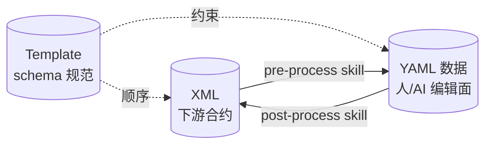
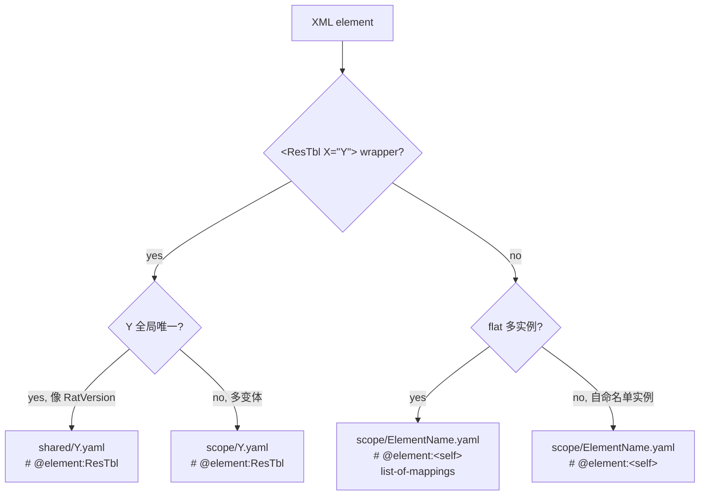

# ai-restble YAML Schema 规范

> 给弱 AI 的**权威协议**。本文档定义 XML ↔ YAML round-trip 的契约。
> 预处理 / 后处理 skill 按本文档实现；编辑 yaml 的人/弱 AI 按本文档解读。
> 配套 fixtures：`tests/fixtures/xml/valid/multi_runmode.expected/`

---

## 0. 三种文件、三种角色



| 文件 | 角色 | 等价标准 | 注解 |
|---|---|---|---|
| **XML** | 下游消费合约 | **字节级一致**（允空白/空行差异） | 无 |
| **YAML 数据** | 人/AI 编辑面 | **语义级一致**（属性集 + 结构等价即可） | 仅 `@element` `@related` `@use` |
| **Template** | schema 规范 | — | 上述 + `@enum` `@range` `@merge` |

**关键洞察：** XML 必须稳定（合约），YAML 不必（编辑面），Template 把"严格"装起来。emit 顺序、约束、合并规则都在 Template，**数据 yaml 只放数据**。

---

## 1. 文件树与命名

### R1 一文件一实例（flat 多实例例外）

XML 顶层 element 1:1 映射 yaml 文件。例外：**flat 多实例形态**（如多个独立 `<CapacityRunModeMapTbl .../>` 行）放进**一个**文件，主体是 list-of-mappings。

### R2 目录即 scope

| 目录 | 含义 |
|---|---|
| `shared/` | 跨 RunMode 共享（**仅当存在 scope folder 时使用**） |
| `<RunMode>/`（如 `0x10000000/`） | 该 RunMode 专属 |
| `template/` | schema 规范文件 |

**无 scope 时平铺根目录**：fixture 没有 RunModeTbl / 多 scope 概念时，所有数据 yaml 直接在 `<fixture>.expected/` 根目录平铺，**不引入空层 `shared/`**。例：`minimal.expected/{FileInfo,RatVersion,FooTbl}.yaml`。

### R3 文件命名公式

**核心规则：file stem = XML reference literal**（保证 XML 字节级一致）

```
stem ::= 任意合法标识符（来自 XML reference value）
file ::= <stem> '.yaml'
```

- **不带 `ResTbl_` 前缀**（即使 XML 元素是 `<ResTbl X="...">` wrapper）
- 同一逻辑表的不同 variant 允许混用 bare / suffixed 形态——以 XML literal 为准。例：
  - `0x10000000/ClkCfgTbl.yaml`（bare，对应 XML `<ResTbl ClkCfgTbl="ClkCfgTbl">`）
  - `0x20000000/ClkCfgTbl_0x20000000.yaml`（suffix，对应 XML `<ResTbl ClkCfgTbl="ClkCfgTbl_0x20000000">`）
- **scope 信息主要靠 folder 提供，suffix 是次要的**——同 folder 内同 stem 文件唯一即可

variantId（当出现时）当前等于 RunMode 值（巧合，非强制）。

---

## 2. 元数据：首行 `@element`

### R4 首行 `# @element:<X>` 必填（FileInfo 例外）

**例外：`FileInfo.yaml`** 是文档根，元素名固定为 `FileInfo`、由文件名隐含；**不需要 `# @element:` 头**。后处理 skill 通过文件名（带或不带 `shared/` 前缀）识别它。

其他每个 yaml 文件首行必为：

```yaml
# @element:<X>
```

`<X>` 两种取值：

| `<X>` | 含义 | 元素名解析 |
|---|---|---|
| `<self>` | 自命名形态 | element = stem 去 variant |
| 显式名（如 `ResTbl`） | wrapper 形态 | element = X |

`<self>` 占位符**故意**包含 XML 非法字符（`<` `>`）——若 skill 实现错误把占位符原样塞进 XML emit，`<<self>...>` 会被 XML parser 立刻拒绝。Fail-fast 设计：错误显式化、定位精确。

### R5 Type-attr 推导（仅 wrapper 形态，即 X ≠ `<self>`）

wrapper 形态的 XML 长这样：`<X TypeAttrName="TypeAttrValue" ...>`，其中 `TypeAttrName` / `TypeAttrValue` 完全从文件 stem 推导：

```
type-attr name  = stem 去 variant
type-attr value = stem 全名（含 variant）
```

例：

| 文件 | element | type-attr |
|---|---|---|
| `0x10000000/RunModeTbl.yaml` 首行 `# @element:<self>` | `<RunModeTbl>` | （无） |
| `0x10000000/ClkCfgTbl.yaml` 首行 `# @element:ResTbl` | `<ResTbl>` | `ClkCfgTbl="ClkCfgTbl"` |
| `0x20000000/ClkCfgTbl_0x20000000.yaml` 首行 `# @element:ResTbl` | `<ResTbl>` | `ClkCfgTbl="ClkCfgTbl_0x20000000"` |
| `shared/DmaCfgTbl.yaml` 首行 `# @element:ResTbl` | `<ResTbl>` | `DmaCfgTbl="DmaCfgTbl"` |

---

## 3. 数据本体

### R6 顶层扁平 mapping

XML 顶层 element 的所有 attributes 平铺到 yaml 顶层（**无 `attribute:` 包裹**）。

### R7 派生字段：`@related:<op>(<arg>)`

派生字段在 XML 是 scalar attribute（值由 codegen 算），在 yaml 中作为 list 的"宿主 key"：

```yaml
ResTblNum: # @related:count(RunModeItem)
- ClkCfgTbl: "ClkCfgTbl"
- DmaCfgTbl: "DmaCfgTbl"
```

emit 时**拆分为 sibling**：

```xml
<RunModeTbl ResTblNum="2">
  <RunModeItem ClkCfgTbl="ClkCfgTbl"/>
  <RunModeItem DmaCfgTbl="DmaCfgTbl"/>
</RunModeTbl>
```

⚠️ **不是嵌套**——下面这种是错的：
```xml
<!-- WRONG -->
<RunModeTbl><ResTblNum><RunModeItem .../></ResTblNum></RunModeTbl>
```

派生 op 全集：

| op | 语义 | arg 形式 |
|---|---|---|
| `count(<Child>)` | 同文件子元素行数 | element 名（无 `.`） |
| `count(<T>.<col>)` | 跨表行数 | path（含 `.`） |

`count` 的两种语义靠 `.` 是否出现自动区分。

### R8 list item = child element 的 attribute set

派生字段下的 list 中，每个 item 是一个 mapping，**每个 key-value 对 = 该 child element 的一个 attribute**。child element 名由父 `@related:count(<X>)` 锚定。

```yaml
LineNum: # @related:count(Line)
- ClkName: "SYS_CLK"          # ↓
  FreqMHz: 600                # 等价于 <Line ClkName="SYS_CLK" FreqMHz="600" Source="PLL0"/>
  Source: "PLL0"              # ↑
```

单 attribute 与多 attribute 同一规则，无简写。

---

## 4. 引用解析

### R9 引用值格式

ref value 永远等于目标文件 stem：

```
value ::= <TableName>                        # 单变体
       |  <TableName> '_' <variantId>        # 多变体
```

例：`"DmaCfgTbl"`（bare 形态）`"ClkCfgTbl_0x20000000"`（带 variant）。注意同一逻辑表的不同 variant 可混用形态——以 XML literal 为准。

### R10 `@use` 解析

| 形态 | 解析 |
|---|---|
| 无 `@use` 注解 | 默认 `./<value>.yaml`（同目录） |
| `# @use:<relative_path>` | 显式相对路径（跨目录必标） |

### R11 `@related:<T>.<c>` FK 形态的 variant 隐式锁定

FK 形态 `@related:T.c`（无括号；语义=identity 引用，对照函数形态如 `@related:count(...)`）按 **type 级**语义解析。该形态典型出现在 Template，也允许出现在数据 yaml。

不带 variant 时：
- 在 wrapper Line 行内：用同行 `RunModeValue` / `RunMode` 等"RunMode 锚字段"绑定 instance
- 否则 fallback 到 `shared/T.yaml`
- 都找不到 → 报 `unresolved-ref`

---

## 5. `template/` 目录

只放一个 meta 文件：``_children_order.yaml``（详见 §6 注解字典）。legacy XML
**当前不基于 schema 模板做运行期校验**——后处理 skill 只读 ``_children_order.yaml``
拼装顺序，对 element data yaml 文件做 emit。

字段顺序 = mapping insertion order（XML emit 按此顺序）。

---

## 6. 注解字典（按出现位置）

### 数据 yaml 文件可用

| 注解 | 位置 | EBNF | 说明 |
|---|---|---|---|
| `# @element:<X>` | 首行 | `'#' ' '? '@element:' (NAME \| '<self>')` | R4 强制首行 |
| `# @related:<op>(<arg>)` | 字段尾 | `'@related:' OP '(' ARG ')'` | R7 派生字段 |
| `# @use:<path>` | 字段尾 | `'@use:' RELATIVE_PATH` | R10 显式跨目录 ref |

### Template 文件可用（叠加上述 +）

| 注解 | 位置 | 说明 |
|---|---|---|
| `# @related:<T>.<c>` | 字段尾 | 逻辑外键 |
| `# @enum:a,b,c` | 字段尾 | 枚举集 |
| `# @range:lo-hi` | 字段尾 | 数值范围 |
| `# @merge:<strategy>` | 字段尾 | `concat(<sep>)` / `sum` / `conflict` |

### 文档级 meta 文件（独立 yaml，非元素文件）

| 文件路径 | 内容 | 说明 |
|---|---|---|
| `template/_children_order.yaml` | yaml list，每项一个 element-class 或 ``<element>:<stem>`` 特例 | XML 顶层元素的 **emit 顺序**。每条 entry **只有两种形式**：(1) **`<Element>` element-class catch-all**（无 `:`）：匹配 ``resolved element name == entry`` 的所有未消费文件，按 ``(stem, full path)`` 字母序排列。(2) **`<element>:<stem>` 特例**（有 `:`）：精确 pin 单个 instance（如 ``ResTbl:CapacityRunModeMapTbl`` 让特定 wrapper 排到指定位置）。匹配按 list 顺序贪心，每文件最多匹配一次；特例先消费，catch-all 后兜底。**协议契约**：同 element 类内 ``(stem, full path)`` 字母序 == XML idx 序——不一致时必须用特例显式 pin 顺序。**文件夹位置（shared/ vs scope/）通过 path 进入 tiebreak**。**所有 fixture 必备**（即便简单 fixture 也要建 template/ 放此文件） |

例：

```yaml
# template/_children_order.yaml — 简单 fixture（仅一个 element type）
- ResTbl

# template/_children_order.yaml — 复合 fixture（多 element type + 早期实例需 pin）
- ResTbl:RatVersion             # 特例：RatVersion 在最前
- ResTbl:CapacityRunModeMapTbl  # 特例：wrapper 紧随其后
- CapacityRunModeMapTbl         # CapacityRunModeMapTbl flat element-class
- RunModeTbl                    # RunModeTbl element-class
- ResTbl                        # 剩余 ResTbl wrappers 字母序兜底
```

下划线前缀的文件名表示"非元素 meta"，跟 element template 文件区分。post-process skill 解析 template/ 时区别对待。

### 形式约定

- 冒号后**无空格**：`@related:Foo.Bar`，不是 `@related: Foo.Bar`
- 行尾注释挂在被注解字段右侧（同行）
- 多个注解可分号分隔：`# @range:0-15; @merge:concat(',')`

---

## 7. Round-trip 不变量

| 不变量 | 含义 |
|---|---|
| **XML 字节级稳定** | 同一 yaml 反复 emit，输出 XML 字节相同（允空白/空行差） |
| **YAML 语义级等价** | XML→yaml→XML 后，yaml 可以变形（顺序/空白），但 emit 出的 XML 字节稳定 |
| **派生字段重生** | LineNum/ResTblNum 不在 yaml source，emit 时 `len(children)` 算 |
| **ref 闭包** | 所有 `@related` / `@use` 必须解析到现存文件，否则报错 |
| **scope 闭包** | local-first → shared-fallback；不跨 scope 静默猜 |
| **属性顺序由 template** | 多 attribute 时按 template 字段定义顺序 emit |

---

## 8. 完整跟读样例

输入 XML：

```xml
<RunModeTbl RunModeDesc="LowPower" RunMode="0x10000000" ResAllocMode="0" ResTblNum="3">
  <RunModeItem ClkCfgTbl="ClkCfgTbl"/>
  <RunModeItem DmaCfgTbl="DmaCfgTbl"/>
  <RunModeItem CoreDeployTbl="CoreDeployTbl"/>
</RunModeTbl>
```

预处理 → `0x10000000/RunModeTbl.yaml`：

```yaml
# @element:<self>
RunModeDesc: "LowPower"
RunMode: 0x10000000
ResAllocMode: 0
ResTblNum: # @related:count(RunModeItem)
- ClkCfgTbl: "ClkCfgTbl"
- DmaCfgTbl: "DmaCfgTbl"          # @use:../shared/DmaCfgTbl.yaml
- CoreDeployTbl: "CoreDeployTbl"
```

弱 AI 跟读流程：

1. 路径 `0x10000000/` → scope = RunMode 0x10000000
2. 首行 `@element:<self>` → element 名 = stem (`RunModeTbl`)
3. stem 无 variant → 自命名形态，无 type-attr
4. 顶层 mapping 4 个 scalar 字段 → 4 个 XML attribute
5. `ResTblNum` 带 `@related:count(RunModeItem)` → 派生字段，scalar value = 3，children = 3 个 `<RunModeItem>`
6. 每个 list item 是单 attribute mapping → `<RunModeItem ClkCfgTbl="..."/>` 等
7. `DmaCfgTbl` 行有 `@use:../shared/DmaCfgTbl.yaml` → ref 跨目录解析

emit 回 XML（按 template 字段顺序）→ 字节级跟原 XML 一致。

---

## 9. Anti-patterns（弱 AI 易踩坑）

| 反例 | 为什么错 | 正确做法 |
|---|---|---|
| `LineNum: 4` 写死 | 派生字段不该写在 source | 删值，仅 `LineNum: # @related:count(Line)` |
| `<ResTblNum><RunModeItem/></ResTblNum>` | 误把 `@related:count(X)` 字段当 children 容器 | sibling 平级 emit |
| 数据 yaml 写 `@enum:...` | 约束属于 template，不是数据 | 搬到 template 文件 |
| `# @related: T.c`（冒号后空格） | 形式不符约定 | `# @related:T.c` |
| `# @element:RunModeTbl` 自命名也写名 | 冗余，自命名用 `<self>` | `# @element:<self>` |
| 文件 stem 跟 XML reference literal 不一致 | 破坏 byte-stable round-trip | stem 必须 = XML literal（bare 或 suffix 由 XML 决定） |
| 跨目录 ref 不标 `@use` | 默认仅同目录 | 显式 `@use:<path>` |

---

## 10. EBNF（给 skill 实现者）

```ebnf
file        ::= header body?
header      ::= '#' ' '? '@element:' element_id NEWLINE
element_id  ::= '<self>' | NAME

body        ::= toplevel_mapping
              | list_of_mappings        (* flat 多实例 *)

toplevel_mapping ::= (kv_line | derived_block)*
kv_line     ::= NAME ':' VALUE annotation?
derived_block ::= NAME ':' annotation_related NEWLINE
                  list_of_child_mappings?
list_of_child_mappings ::= ('-' mapping)+

annotation  ::= '#' ' '* (single_annot (';' single_annot)*)
single_annot ::= '@' NAME (':' annot_payload)?

(* @related 是规范里唯一支持两种形态的注解 *)
annotation_related  ::= '@related:' (op_call | path)
op_call             ::= OP '(' op_arg ')'
op_arg              ::= path (',' kw_arg)*
kw_arg              ::= NAME '=' (NAME | path | LITERAL)
path                ::= NAME ('.' NAME)?
OP                  ::= 'count' | 'sum' | 'bitmap' | ...

NAME                ::= [A-Za-z_][A-Za-z0-9_]*
VALUE               ::= STRING | INT | HEX | LIST_BLOCK
LITERAL             ::= STRING | INT | HEX
```

---

## 附录 A：从 XML 到文件落点的决策树



## 附录 B：术语对照

| 术语 | 含义 |
|---|---|
| 逻辑表 (logical table) | 抽象的数据表概念。多对多映射到 XML element：可能是真元素，也可能是 ResTbl 的 type-attr |
| 自命名 (self-named) | XML element name = 逻辑表名（如 `<RunModeTbl>`） |
| Wrapper 形态 | XML 用 `<ResTbl X="...">` 表达逻辑表，逻辑表名在 type-attr 里 |
| variant | 同一逻辑表在不同 RunMode 下的实例（如 LowPower 下的 bare `ClkCfgTbl` / HighPerf 下的 suffix `ClkCfgTbl_0x20000000`） |
| scope | 解析作用域，对应一个目录（`shared/` 或 `<RunMode>/`） |
| 派生字段 | XML 中存在但 yaml source 不写的 attribute，emit 时由 codegen 算（如 LineNum） |
| type-attr | wrapper 形态 `<ResTbl X="Y">` 中的 X="Y" 这对，name/value 都从文件名推导 |
| Round-trip | XML→yaml→XML 流程；本 schema 保证 XML 字节级稳定 |
