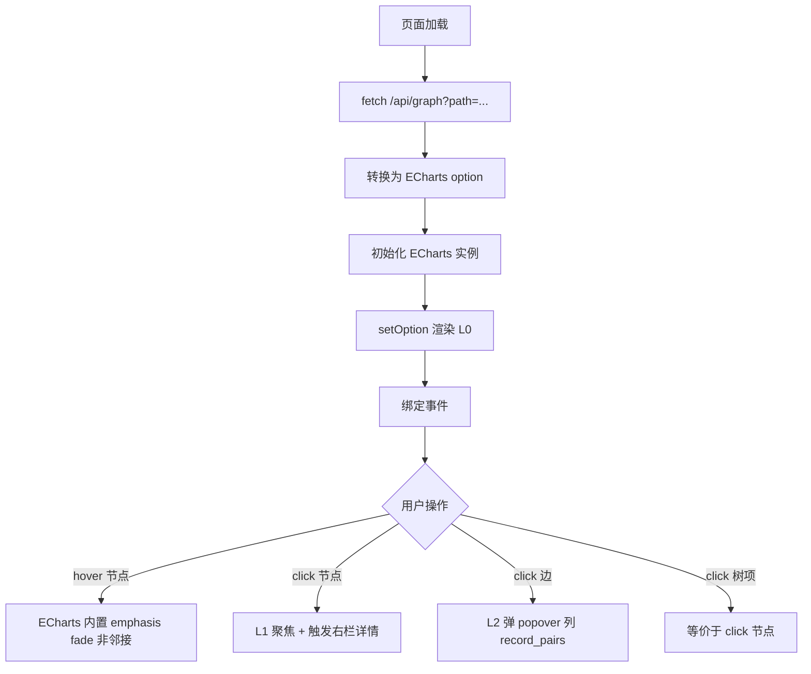

# Skill: ECharts 画布 — graph JSON → 三栏交互界面

## Role
你是 ai-restble 的 **canvas skill** 实现者。任务是用 ECharts graph series 渲染
graph builder 输出的 JSON，提供 L0/L1/L2 三层渐进式交互。

## Task
单页面 HTML/JS，**仅用 CDN 加载 ECharts 5.x**，渲染 `/api/graph` 返回的 JSON 为
三栏布局（左树 / 中画布 / 右详情），实现 hover 邻接高亮 + click 节点详情 +
click 边 record-pair 列表。

## Context

- **权威协议**：`prompts/phase2/01-graph-builder.md`（输入 JSON schema）
- **框架决策**：见项目记忆 [ai-restble Viz Stack] —— ECharts + form panel，**不**用 Cytoscape / React Flow / vis-network
- **不写构建链**：单 HTML 文件，所有 JS 走 CDN（ECharts unpkg / jsdelivr）
- **绑定后端**：Flask 提供 `GET /api/graph?path=<yaml_dir>`，前端 fetch
- **Phase 2A read-only**：仅展示和聚焦交互，**不**编辑（编辑见 `03-detail-panel.md` 的 2B 部分）

## Rules

| # | 规则 | 你必须做的 |
|---|---|---|
| C1 | **categories 表达 scope** | `meta.categories` → ECharts `series.categories[]`，每个 category 自动一种颜色；node.category 决定着色 |
| C2 | **力布局 + roam** | `series.layout: 'force'`，`roam: true`；`force.repulsion=200`、`force.gravity=0.1` 让同 category 聚团 |
| C3 | **L0 全图默认渲染** | 启动加载 graph JSON → 转 ECharts option → setOption；显示所有节点 + 表级聚合边 |
| C4 | **L1 hover 邻接高亮** | `emphasis.focus: 'adjacency'` 一行配置——hover 节点自动 fade 非邻接，无需自定义 |
| C5 | **L1 click 聚焦** | click 节点 → 调用 `referenced_by` 查询其入边 → highlight 入/出边 + 邻居节点；右栏触发详情 |
| C6 | **L2 click 边** | click 边 → 弹小 popover 列出 `edge.record_pairs`，每行一对 src→dst record key |
| C7 | **复合 FK 边标** | `fk_fields.length > 1` 时边 label = `<refName>(<f1>+<f2>)`；length=1 时 label = `<refName>` |
| C8 | **unresolved 边样式** | `unresolved=true` 的边 `lineStyle: {color: 'red', type: 'dashed'}` |
| C9 | **三栏布局** | 左 1/5 树（node 列表，按 category 分组）/ 中 3/5 画布 / 右 1/5 详情面板 |
| C10 | **错误兜底** | fetch 失败 / JSON 格式错 → 中央显示错误提示，不白屏 |

## Steps



具体执行：

1. **三栏 HTML 骨架**：左 `<aside id="tree">`、中 `<div id="canvas">`、右 `<aside id="panel">`；CSS `display: grid; grid-template-columns: 20% 60% 20%`
2. **CDN 引入**：`<script src="https://cdn.jsdelivr.net/npm/echarts@5/dist/echarts.min.js">`
3. **fetch graph JSON**：`fetch('/api/graph?path=' + path)`，失败显示错误
4. **构造 option**：见下面 [Output Format] 模板
5. **初始化 + 渲染**：`echarts.init(document.getElementById('canvas')).setOption(option)`
6. **绑定事件**：
   - `chart.on('click', {dataType: 'node'}, e => showNodeDetail(e.data))`
   - `chart.on('click', {dataType: 'edge'}, e => showEdgePopover(e.data))`
   - 树项 click → 触发 chart 聚焦邻接（`chart.dispatchAction({type: 'focusNodeAdjacency', seriesIndex: 0, dataIndex: <nodeIdx>})`，graph series 专属 action）
7. **right panel** 渲染：调用 `03-detail-panel.md` 的 `renderNodeDetail(node)`
8. **L2 popover**：简单 div 浮层显示 `edge.record_pairs` 列表

## Output Format

### ECharts option 模板

```javascript
const option = {
  tooltip: {
    formatter: params => {
      if (params.dataType === 'node') {
        return `<b>${params.data.name}</b><br/>scope: ${params.data.category}<br/>${params.data.records_preview} records`;
      }
      return `${params.data.label.formatter}`;
    }
  },
  legend: [{
    data: graphJson.meta.categories
  }],
  series: [{
    type: 'graph',
    layout: 'force',
    roam: true,
    draggable: true,
    label: { show: true, position: 'inside' },
    edgeLabel: { show: true, formatter: e => e.data.label },
    emphasis: {
      focus: 'adjacency',
      lineStyle: { width: 4 }
    },
    force: {
      repulsion: 200,
      gravity: 0.1,
      edgeLength: 120
    },
    categories: graphJson.meta.categories.map(c => ({ name: c })),
    data: graphJson.nodes.map(n => ({
      id: n.id,
      name: n.id,
      category: n.category,
      symbolSize: 30 + Math.min(n.records_preview * 2, 40),
      itemStyle: n.kind === 'FileInfo' ? { borderType: 'dashed' } : {}
    })),
    links: graphJson.edges.map(e => ({
      id: e.id,
      source: e.from,
      target: e.to,
      label: e.fk_fields.length > 1
        ? `${e.ref_name}(${e.fk_fields.join('+')})`
        : e.ref_name,
      lineStyle: e.unresolved
        ? { color: 'red', type: 'dashed' }
        : {}
    }))
  }]
};
```

### 单 HTML 完整骨架

```html
<!doctype html>
<html lang="zh-CN">
<head>
  <meta charset="utf-8">
  <title>ai-restble — Phase 2A canvas</title>
  <link rel="stylesheet" href="https://cdn.jsdelivr.net/npm/bootstrap@5/dist/css/bootstrap.min.css">
  <script src="https://cdn.jsdelivr.net/npm/echarts@5/dist/echarts.min.js"></script>
  <style>
    body { margin: 0; height: 100vh; }
    .layout { display: grid; grid-template-columns: 20% 60% 20%; height: 100vh; }
    aside { padding: 1rem; overflow: auto; border: 1px solid #e5e5e5; }
    #canvas { background: #fafafa; }
    .err { color: #dc3545; padding: 2rem; }
  </style>
</head>
<body>
<div class="layout">
  <aside id="tree"></aside>
  <div id="canvas"></div>
  <aside id="panel">点选节点查看详情</aside>
</div>
<script>
const yamlDir = new URLSearchParams(location.search).get('path') || '';
fetch('/api/graph?path=' + encodeURIComponent(yamlDir))
  .then(r => r.json())
  .then(renderCanvas)
  .catch(e => document.getElementById('canvas').innerHTML = '<div class="err">加载失败：' + e + '</div>');

function renderCanvas(g) {
  // build option (见上)
  // chart.setOption(option)
  // bind events
  // renderTree(g)
}

function renderTree(g) {
  // 按 category 分组列出节点
}

function showNodeDetail(node) {
  // 调用 03-detail-panel 的 renderNodeDetail
}

function showEdgePopover(edge) {
  // 弹层显示 edge.record_pairs
}
</script>
</body>
</html>
```

## Examples

### Example 1：点节点的视觉反馈

用户点 `DmaCfgTbl` 节点：
1. ECharts emphasis 自动 fade 非邻接节点和边
2. 右栏调用 `renderNodeDetail({id:'DmaCfgTbl', records:[...]}) `
3. 左树项 `DmaCfgTbl` 加 `.active` 高亮

### Example 2：复合 FK 边标

graph JSON：`{ref_name: "module", fk_fields: ["moduleType", "moduleIndex"]}`
→ 画布上边显示 `module(moduleType+moduleIndex)`

### Example 3：unresolved 边

graph JSON：`{unresolved: true, ref_name: "dma", fk_fields: ["channelId"]}`
→ 红色虚线边 + label `dma`，hover tooltip 显示"⚠ 目标 record 不存在"

### Example 4：空 fixture（minimal）

graph JSON：`{nodes: [3 个], edges: [], categories: ["root"]}`
→ 渲染 3 个节点，全部 root category 同色，无边；不报错

## Quality Checklist

- [ ] CDN 加载，无 npm/构建链
- [ ] 三栏 layout 在 1280px+ 屏幕正常显示
- [ ] hover 节点 emphasis 邻接高亮工作（不写自定义 fade 代码）
- [ ] click 节点 → 右栏详情触发
- [ ] click 边 → popover 列 record_pairs（即使 record_pairs=[] 也显示"聚合空"）
- [ ] 复合 FK 边标格式 `refName(f1+f2)` 正确
- [ ] unresolved 边红虚线
- [ ] 空 edge 数组不报错
- [ ] fetch 失败 / JSON 解析失败显示用户友好错误
- [ ] window resize → chart.resize() 重排

## Edge Cases

| 情况 | 处理 |
|---|---|
| 节点数 > 200 | force 布局 `repulsion` 调高到 400，否则收敛慢；超 1000 提示用户开过滤 |
| 同名节点冲突 | 不应发生（builder G1 保证），若发生 → 控制台 warn |
| graph JSON 缺字段 | 容错：用默认值（如 `category` 缺 → "root"），不白屏 |
| 浏览器无 fetch | 不支持，提示升级浏览器（Chrome 60+ / 现代主流） |
| 节点点击事件双触发 | ECharts 默认就是单次 click，无需防抖 |

## 解决冲突的兜底原则

- **声明式优先**：能用 option 配置完成的不写命令式 chart.dispatchAction（除非交互必需）
- **样式走 ECharts 内置**：不写自定义 SVG / Canvas 绘制
- **不在 canvas 上做编辑**：所有 mutation 走右栏 form panel，画布只读
