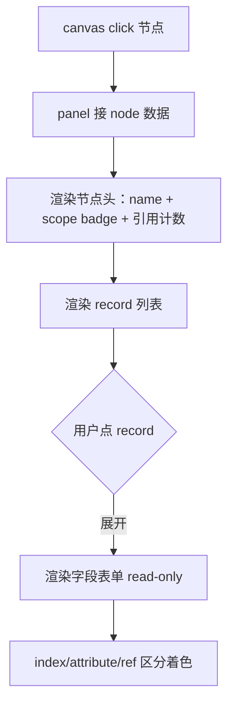

# Skill: 右栏详情/编辑面板 — 表单驱动的 record 编辑

## Role
你是 ai-restble 的 **detail-panel skill** 实现者。任务是在右栏渲染选中节点的
record 列表 + 字段编辑表单。**所有编辑动作发生在这里**（不在画布上）。

## Task
监听画布 click 事件 → 接收 `node` 数据 → 渲染 record 列表 + 字段表单；
Phase 2A 仅展示，Phase 2B 加编辑/级联预警/写回。

## Context

- **权威协议**：`prompts/phase2/01-graph-builder.md`（输入数据形态）；`02-echarts-canvas.md`（事件来源）
- **框架决策**：见项目记忆 [ai-restble Viz Stack] —— **编辑通过 form panel**，不在画布上拖
- **referenced_by 反查表**：graph JSON 提供，编辑前预警 / 编辑后级联用
- **后端 API 约定**：
  - `GET /api/graph?path=<dir>` — 拉 graph JSON（02 已用）
  - `POST /api/record` — 单 record 写回（**Phase 2B**，2A 不调用）
  - `DELETE /api/record` — 删 record（**Phase 2B**）
- **Phase 2A 范围**：仅 D1/D2/D3（read-only 展示）；D4-D8 为 2B 范围，prompt 标注但 2A 不实现

## Rules

| # | 规则 | Phase | 你必须做的 |
|---|---|---|---|
| D1 | **节点点击 → 显示 record 列表** | 2A | 取 `node.records[]`，列出每条 record 的 index 字段值（如 `channelId=0x10`），点击展开字段详情 |
| D2 | **字段详情区分 region** | 2A | index 字段标蓝、attribute 标灰、ref 标橙；ref 字段值显示 `→ TargetTable.col=value` 形式 |
| D3 | **referenced_by 在节点头展示** | 2A | 节点选中后，节点头部显示"被 N 处引用"（取自 graph.referenced_by 中以本表 record 为 target 的条目数量） |
| D4 | **字段值改动可编辑** | 2B | text/number/dropdown 三类输入；ref 字段强制用 dropdown（选项=目标表 records 的 index 字符串） |
| D5 | **改值前级联预警** | 2B | 改 index 字段或被引用的 attribute 字段时，查 `referenced_by` → 弹"将影响 N 处引用，是否级联更新?"（modal 列出引用方） |
| D6 | **提交走 API** | 2B | `POST /api/record` 携带 `{table, old_index, new_record, cascade: bool}`；后端写回 yaml + 级联 → 返回新 graph JSON → 前端整体重渲 |
| D7 | **删 record 保护** | 2B | 删除前查 referenced_by 非空 → 弹三选项："拒绝删除" / "同步删引用方" / "保留引用方但置 unresolved" |
| D8 | **乐观 UI + 失败回滚** | 2B | 提交时立即更新前端态；后端失败 → 还原 + 显示错误 |

## Steps

### Phase 2A（必须实现）



1. **暴露入口函数** `renderNodeDetail(node, graphJson)`：清空 panel → 渲染头部 → record 列表 → 默认展开第 1 条
2. **节点头部**：node.id + category badge + element 类型 + "× N records" + "被 M 处引用"（M 来自反查 referenced_by）
3. **record 列表**：每条一行，显示 index 字段拼接（`channelId=0x10`），点击切换展开/收起
4. **字段表单（read-only）**：分三组（index/attribute/ref），每组按 region 着色，每行 `<label> <value>`

### Phase 2B（编辑路径，gated）

5. 字段值用 `<input>` / `<select>`；ref 字段值用 `<select>`，选项从 graphJson 中目标表的 records.index 提取
6. 改值时调用 `checkCascade(table, fieldName, oldValue)` → 查 referenced_by → 若非空弹 modal
7. 提交按钮 → `POST /api/record` → 后端处理 → 重新 fetch graph → 重渲整张图
8. 错误处理：API 4xx/5xx → toast 显示错误，表单回滚到提交前状态

## Output Format

### Phase 2A 渲染样例（HTML）

```html
<aside id="panel">
  <div class="node-header">
    <h5>DmaCfgTbl <span class="badge bg-info">shared</span></h5>
    <small class="text-muted">ResTbl · 4 records · 被 2 处引用</small>
  </div>
  <div class="record-list">
    <details open>
      <summary>channelId = 0x10</summary>
      <div class="field-group region-index">
        <strong>index</strong>
        <div class="field-row"><label>channelId</label><span>0x10</span></div>
      </div>
      <div class="field-group region-attribute">
        <strong>attribute</strong>
        <div class="field-row"><label>srcType</label><span>ddr</span></div>
        <div class="field-row"><label>dstType</label><span>core</span></div>
      </div>
      <div class="field-group region-ref">
        <strong>ref</strong>
        <div class="field-row"><label>module</label><span>→ Module.moduleType=cpu, moduleIndex=0</span></div>
      </div>
    </details>
    <details>
      <summary>channelId = 0x20</summary>
      ...
    </details>
  </div>
</aside>
```

### CSS 配色

```css
.region-index    { border-left: 3px solid #0d6efd; padding-left: .5rem; } /* 蓝 */
.region-attribute{ border-left: 3px solid #6c757d; padding-left: .5rem; } /* 灰 */
.region-ref      { border-left: 3px solid #fd7e14; padding-left: .5rem; } /* 橙 */
.field-row       { display: flex; justify-content: space-between; padding: .25rem 0; }
.field-row label { font-family: monospace; color: #495057; }
.field-row span  { font-family: monospace; }
```

### Phase 2B：编辑表单关键片段

```html
<div class="field-row editable">
  <label>srcType</label>
  <input type="text" value="ddr" data-field="srcType" data-region="attribute">
</div>

<div class="field-row editable region-ref">
  <label>module.moduleType</label>
  <select data-field="module.moduleType">
    <option>cpu</option>
    <option>dsp</option>
  </select>
</div>

<button class="btn btn-primary" onclick="submitEdit()">保存</button>
```

### Phase 2B：级联预警 modal

```javascript
async function checkCascade(table, fieldName, oldValue, newValue) {
  const refKey = `${table}.${fieldName}=${oldValue}`;
  const referrers = graphJson.referenced_by[refKey] || [];
  if (referrers.length === 0) return { cascade: true };  // 无引用，直接改
  const ok = await showModal(
    `将影响 ${referrers.length} 处引用：`,
    referrers.map(r => `${r.src_table}.${r.src_index}.${r.ref_name}`).join('\n'),
    ['取消', '级联更新', '仅改自身（引用方将 unresolved）']
  );
  return ok;
}
```

## Examples

### Example 1：read-only 展示（Phase 2A）

输入 node：
```json
{
  "id": "DmaCfgTbl", "scope": "shared", "kind": "Table", "element": "ResTbl",
  "records": [
    {"index": {"channelId": "0x10"}, "attribute": {"srcType": "ddr"}, "ref": {}},
    {"index": {"channelId": "0x20"}, "attribute": {"srcType": "axi"}, "ref": {}}
  ]
}
```

渲染：节点头 + 2 条 record（默认展开第 1 条），无编辑控件。

### Example 2：被引用展示（Phase 2A）

graph.referenced_by 含 `DmaCfgTbl.channelId=0x10` → 2 个 referrer。
节点头显示"× 2 records · 被 1 处引用（0x10）"。
`channelId=0x10` 这条 record 旁加 🔗 图标，hover 提示"被 RunModeItem.cpu0.dma 引用"。

### Example 3：复合 ref 字段展示

ref 字段值为 mapping `{moduleType: cpu, moduleIndex: 0}`：
渲染为：
```
ref module → Module.(moduleType=cpu, moduleIndex=0)
```
不展开成多行，保持紧凑。

### Example 4：编辑级联（Phase 2B）

用户改 `DmaCfgTbl.channelId` 从 `0x10` → `0x11`：
1. checkCascade 查 referenced_by[`DmaCfgTbl.channelId=0x10`]
2. 发现 `RunModeItem.cpu0.dma` 引用此 record
3. modal 弹"将影响 1 处引用：RunModeItem.cpu0.dma"
4. 用户选"级联更新" → POST /api/record `{table:'DmaCfgTbl', old_index:{channelId:'0x10'}, new_record:{...}, cascade:true}`
5. 后端原子写回 DmaCfgTbl + RunModeItem 两个 yaml；返回新 graph JSON
6. 前端 setOption 重渲，所有边自动指向新 record

## Quality Checklist

### Phase 2A

- [ ] 接收 node 数据后立即渲染，无加载延迟
- [ ] index/attribute/ref 三区域视觉清晰（左边框颜色不同）
- [ ] 默认展开第 1 条 record，其余收起
- [ ] 引用计数从 graph.referenced_by 动态计算，不写死
- [ ] 空 records → 显示"该表暂无 record"，不空白
- [ ] 节点切换时 panel 内容立即刷新（无残留前一节点信息）

### Phase 2B（额外）

- [ ] ref 字段下拉的选项 = 目标表所有 record.index 字符串
- [ ] 改值前必走 checkCascade
- [ ] 级联 modal 列出所有 referrers 不省略
- [ ] 提交 API 失败 → 表单回滚 + toast 错误
- [ ] 删 record 三选项行为正确（拒删 / 同步删 / 置 unresolved）

## Edge Cases

| 情况 | 处理 |
|---|---|
| node 无 records 字段（FileInfo） | 列出顶层 attribute 字段，不显示 record list |
| ref 字段值为 None | 显示"未配置"，不报错 |
| ref 字段值为 list（@index:repeatable） | 列出每个元素，每个独立 cascade 检查 |
| referenced_by 中跨 scope 引用 | 列出时标注 scope（`shared/RunModeItem` vs `0x00000000/RunModeItem`） |
| 编辑提交期间用户切换节点 | 禁用切换 / 提示"提交中"，避免状态错乱 |

## 解决冲突的兜底原则

- **编辑只走表单**：永远不监听画布 mouse drag 写值
- **改值必查 referenced_by**：除非字段不在反查表 key 中
- **后端为准**：前端乐观更新只是 UX 糖；最终状态以 API 返回的新 graph JSON 为准
- **2A 不调写 API**：read-only 阶段只 GET，不 POST/DELETE
