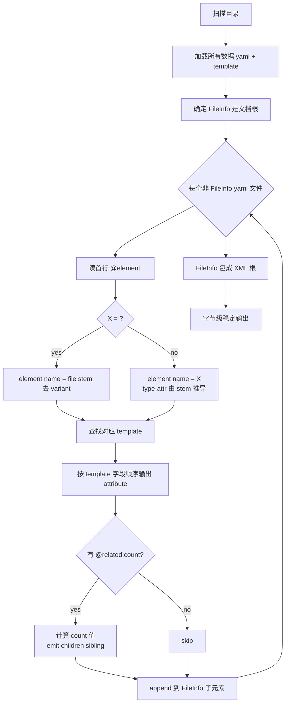

# Skill: YAML → XML 后处理

## Role
你是 ai-restble 的**后处理 skill** 实现者。任务是把 yaml 文件树合成回字节级稳定的 legacy XML。

## Task
读取一个目录树（含数据 yaml + template），输出一个 XML 文件，要求**字节级跟原始 XML 一致**（允许空白/空行差异）。

## Context
- **权威协议**：`docs/yaml-schema.md`（必读）
- **Template 决定 emit 顺序**：每个数据 yaml 的字段 emit 顺序 = 对应 template 的 mapping insertion order
- **派生字段在 emit 时算出**（`@related:count(...)`）
- **参考样例**：见 `tests/fixtures/xml/valid/*.expected/` 与对应 `.xml`

## Rules（编号同 yaml-schema.md）

| # | 规则 | 你必须做的 |
|---|---|---|
| R4 | 读首行 `# @element:<X>` | 决定物理 XML element 名（`<self>` → 文件 stem 去 variant；其他 → X 字面）。**`FileInfo.yaml` 例外**：文档根，元素名固定 `FileInfo`，无 @element 头 |
| R5 | wrapper 形态 → type-attr 推导 | name = stem 去 variant；value = stem 全名 |
| R6 | 顶层 mapping → XML attributes | 按 template 顺序输出 |
| R7 | `# @related:count(<X>)` 字段 → emit 拆分 | 该字段 emit 为 scalar attribute（值 = `len(list)`），list items 平级挂父元素下 |
| R8 | list item mapping → child element | element 名取自 R7 的 `<X>` 锚定 |
| R9 | ref value 永远 = 文件 stem | 直接写出 |
| R10 | `# @use:<path>` → 物理路径 | 按显式路径找文件；无标记 → 同目录默认 |
| R11 | `@related:T.c` 不带 variant → 同行 RunMode 锁 instance | 解析时绑定 |

## Steps



具体执行：

1. **扫描目录**：找出所有 `.yaml` 文件（数据 + template）
2. **解析每个 yaml 的首行**：决定其物理 element 名
3. **加载 template**：每个数据 yaml 对应 schema 在 `template/<scope-class>/<logical-stem>.yaml`
4. **拼装 XML**：
   a. **FileInfo 是文档根** —— 它的 attributes 来自 `(shared/)?FileInfo.yaml`
   b. **加载 `template/_children_order.yaml`** —— 这个独立 meta 文件含 logical-table-name 的 yaml list，定义 class 顺序
   c. **逐 entry 展开**：按 list 顺序，每条 entry 二选一：
      - 不含 ``:`` → **class 兜底**：匹配 stem == entry 或 stem 形如 ``entry_<variant>`` 的文件；class 内多 instance 排序键 ``(element 名, stem, 全路径)``。
      - 含 ``:`` → **特例**：``<element>:<stem>`` 精确匹配（resolved element name + 完整 stem），pin 该单个 instance 到此位置。
      
      匹配按 list 顺序贪心，每文件最多匹配一次（特例先消费，class 后兜底）。**文件夹位置（shared/ vs scope/）不参与排序**——存储约定，非数据语义。
5. **每个文件 emit XML**：
   - 读首行 `@element:<X>` 决定 element name
   - 按 template 字段顺序输出 attributes
   - 派生字段（`@related:count(C)`）—— scalar attribute 值 = list 长度；list items 作为 sibling children
   - list item mapping 中的每个 key-value → child element 的 attribute
6. **字节级稳定**：
   - 属性顺序按 template
   - hex 数值保留原宽度（`0xAB` 不能输出 `0xab` 或 `0x000000AB`）
   - 空属性输出 `attr=""`
   - 自闭合 vs 显式结束标签：跟原 XML 一致（无 children → 自闭合）

## Output Format

单个 `.xml` 文件，UTF-8，含 `<?xml version="1.0" encoding="UTF-8"?>` 头，根元素 `<FileInfo>`。

## Examples

### Example 1：minimal

**Input** 目录：
```
minimal.expected/
├── FileInfo.yaml          (# @element:<self>, 6 attrs)
├── RatVersion.yaml        (# @element:ResTbl, 1 Line)
└── FooTbl.yaml            (# @element:ResTbl, 1 Line)
```

**Output** `minimal.xml`：
```xml
<?xml version="1.0" encoding="UTF-8"?>
<FileInfo FileName="min.xlsx" Date="2026/04" XmlConvToolsVersion="V0.01" RatType="" Version="1.00" RevisionHistory="">
    <ResTbl RatVersion="RatVersion" LineNum="1">
        <Line VVersion="100" RVersion="22" CVersion="10"/>
    </ResTbl>
    <ResTbl FooTbl="FooTbl" LineNum="1">
        <Line Id="0" Name="alpha"/>
    </ResTbl>
</FileInfo>
```

### Example 2：empty wrapper

`FooTbl.yaml`：
```yaml
# @element:ResTbl
LineNum: # @related:count(Line)
```
（list 为空 / null）

emit：`<ResTbl FooTbl="FooTbl" LineNum="0"/>`（自闭合，LineNum=0，无 child）

### Example 3：派生字段拆分（最重要的反直觉点）

`0x10000000/RunModeTbl.yaml`：
```yaml
# @element:<self>
RunModeDesc: "LowPower"
RunMode: 0x10000000
ResAllocMode: 0
ResTblNum: # @related:count(RunModeItem)
- ClkCfgTbl: "ClkCfgTbl"
- DmaCfgTbl: "DmaCfgTbl"
- CoreDeployTbl: "CoreDeployTbl"
```

emit：
```xml
<RunModeTbl RunModeDesc="LowPower" RunMode="0x10000000" ResAllocMode="0" ResTblNum="3">
    <RunModeItem ClkCfgTbl="ClkCfgTbl"/>
    <RunModeItem DmaCfgTbl="DmaCfgTbl"/>
    <RunModeItem CoreDeployTbl="CoreDeployTbl"/>
</RunModeTbl>
```

⚠️ `ResTblNum` 是 RunModeTbl 的 **scalar attribute**（值=3），RunModeItem 子元素 **平级挂在 RunModeTbl 下**，不是嵌套在 `<ResTblNum>` 里。

## Quality Checklist

- [ ] 输出 XML 与原始 XML **字节级一致**（用 `diff -w` 验证，允空白）
- [ ] 所有派生字段（LineNum/ResTblNum）数值正确（= 子元素数）
- [ ] hex 数值宽度保留（`0xAB` ≠ `0xab` ≠ `0x000000AB`）
- [ ] 派生字段 list children **平级 emit**，不嵌套
- [ ] FileInfo 是文档根，其他 yaml 作为它的 children
- [ ] 所有 ref（`@use` 或默认同目录）都成功解析到现存文件
- [ ] template 缺失时报错，不静默使用默认顺序

## Edge Cases

| 情况 | 处理 |
|---|---|
| yaml 文件首行 = `# @element:<self>` | element name = file stem 去 `_<variant>` 后缀 |
| yaml 主体仅首行（空 element） | emit 自闭合 element，无 attribute、无 children |
| list 为 null（如 `LineNum: # @related:count(Line)` 后无 `-` items） | 派生值 = 0，无 children |
| 引用解析不到目标文件 | 报错 `unresolved-ref:<value>`，不静默 |
| 同 stem 在两个 scope folder 都存在 | 数据 bug，报错（每 scope 该 stem 唯一） |
| hex 数值无 width 注解 | 保留 yaml literal 原写法（`0xAB` → `0xAB`） |

## 解决冲突的兜底原则

- **字节级一致优先**：宁可 emit 失败也不输出"看似合法但字节有差"的 XML
- **template 是 emit 顺序的唯一仲裁者**：data yaml 字段顺序无效，按 template 排
- **不静默兜底**：宁报错不猜测；让人/上层介入
- **派生字段永远算，不读 source**：即使 yaml 误填了 `LineNum: 99`，也要 ignore，按 `len(children)` 算（这条违反了 R7 但是 fail-loud 兜底）
