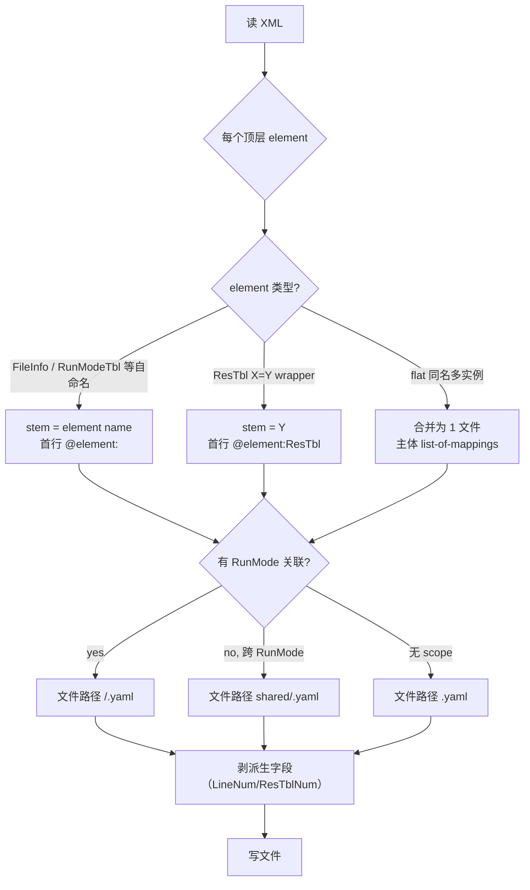

# Skill: XML → YAML 预处理

## Role
你是 ai-restble 的**预处理 skill** 实现者。任务是把 legacy XML 拆解成符合 ai-restble schema 的 yaml 文件树。

## Task
读取一个 legacy XML 文件，输出一个目录树，目录里是若干 yaml 文件。每个 XML 顶层 element 对应一个 yaml 文件（flat 多实例例外，多个同名实例合并为 list-of-mappings）。

## Context
- **权威协议**：`docs/yaml-schema.md`（必读）。包括 R1-R11 规则、注解全集、文件命名公式、目录布局。
- **参考样例**：`tests/fixtures/xml/valid/multi_runmode.expected/`（最丰富，含 wrapper / 自命名 / flat / 多 scope / 多 variant 各情形）。
- **简单样例**：`tests/fixtures/xml/valid/{minimal,empty_table,hex_widths}.expected/`（无 scope 平铺根目录）。

## Rules（编号同 yaml-schema.md，便于对照）

| # | 规则 | 你必须做的 |
|---|---|---|
| R1 | 一文件一实例 | 顶层 element → 一个 yaml 文件。flat 多实例（如多个 `<CapacityRunModeMapTbl />`）合并为 list 主体 |
| R2 | 目录 = scope | 有 RunMode 维度 → 用 `shared/` + `<RunMode>/` 子目录；无 RunMode → flat 根目录 |
| R3 | 文件 stem = XML literal | wrapper `<ResTbl X="Y">` → 文件名 `Y.yaml`；自命名 `<X .../>` → 文件名 `X.yaml`。**绝不带 `ResTbl_` 前缀** |
| R4 | 首行 `# @element:<X>` | 自命名 → `# @element:<self>`；wrapper → `# @element:ResTbl`（实际 element 名） |
| R6 | 顶层扁平 mapping | XML attribute 直接平铺到 yaml 顶层，不要 `attribute:` 包裹 |
| R7 | 派生字段 → `# @related:count(<Child>)` | 该字段 emit 时算 `len(children)`；yaml 里其值是 children list |
| R8 | list item = child element 的 attribute set | mapping 每个 key-value 对 = child 的一个 attribute |
| R9 | 引用 value 永远 = 文件 stem | RunModeItem `<X="Y"/>` → yaml 写 `- X: "Y"` |
| R10 | 同目录 ref 默认；跨目录加 `# @use:<path>` | 自动判断 |

## Steps



具体执行：

1. **解析 XML**，得到 element 树。
2. **遍历顶层 element**：
   - 若 `<FileInfo>` —— 拆出其自身 attributes 写一个 yaml 文件，**children 各自递归拆分**
   - 若 `<ResTbl X="Y" .../>` —— 这是 wrapper，stem = Y
   - 若其他自命名 element —— stem = element name
3. **决定 scope**：
   - 元素引用 RunMode（如 RunModeTbl 自带 RunMode 字段，或 ResTbl 的 type-attr value 带 `_<RunMode>` 后缀）→ 放对应 `<RunMode>/` 目录
   - 跨 RunMode 通用 → `shared/`
   - 全文档无 RunMode → 根目录平铺
4. **生成 yaml 内容**：
   - 首行 `# @element:<X>`
   - 顶层是 element 的所有 attributes（**剔除派生字段** LineNum/ResTblNum，由 `@related:count(...)` 注解锚定）
   - children 作为派生字段下的 list-of-mappings
5. **检测跨目录引用**：list item 的 value 指向不在同目录的文件 → 在该行注释 `# @use:<相对路径>`
6. **写文件**到目录树。

## Output Format

目录结构（按 fixture 复杂度有 3 种形态）：

```
<output_dir>/                    无 scope 时
├── FileInfo.yaml
├── RatVersion.yaml
└── <Other>.yaml
```

```
<output_dir>/                    有 scope 时
├── shared/
│   ├── FileInfo.yaml
│   └── <SharedTable>.yaml
└── <RunMode>/
    ├── RunModeTbl.yaml
    └── <ScopedTable>.yaml
```

## Examples

### Example 1：minimal（无 scope）

**Input** `minimal.xml`：
```xml
<FileInfo FileName="min.xlsx" Date="2026/04" XmlConvToolsVersion="V0.01" RatType="" Version="1.00" RevisionHistory="">
  <ResTbl RatVersion="RatVersion" LineNum="1">
    <Line VVersion="100" RVersion="22" CVersion="10"/>
  </ResTbl>
  <ResTbl FooTbl="FooTbl" LineNum="1">
    <Line Id="0" Name="alpha"/>
  </ResTbl>
</FileInfo>
```

**Output** `minimal.expected/`：
```yaml
# FileInfo.yaml
# @element:<self>
FileName: "min.xlsx"
Date: "2026/04"
XmlConvToolsVersion: "V0.01"
RatType: ""
Version: "1.00"
RevisionHistory: ""
```
```yaml
# RatVersion.yaml
# @element:ResTbl
LineNum: # @related:count(Line)
- VVersion: 100
  RVersion: 22
  CVersion: 10
```
```yaml
# FooTbl.yaml
# @element:ResTbl
LineNum: # @related:count(Line)
- Id: 0
  Name: "alpha"
```

### Example 2：multi_runmode（有 scope，含 wrapper + 自命名 + flat）

参见 `tests/fixtures/xml/valid/multi_runmode.expected/` 完整目录。**关键观察点**：

- `<RunModeTbl RunMode="0x10000000" .../>` → `0x10000000/RunModeTbl.yaml`，首行 `@element:<self>`
- `<ResTbl ClkCfgTbl="ClkCfgTbl" .../>` → `0x10000000/ClkCfgTbl.yaml`（bare value）
- `<ResTbl ClkCfgTbl="ClkCfgTbl_0x20000000" .../>` → `0x20000000/ClkCfgTbl_0x20000000.yaml`（suffix）
- `<ResTbl DmaCfgTbl="DmaCfgTbl" .../>` 跨 runmode 共享 → `shared/DmaCfgTbl.yaml`
- 多个 `<CapacityRunModeMapTbl ... />` flat → 每 RunMode 一个文件 `<RunMode>/CapacityRunModeMapTbl.yaml`

### Example 3：empty_table（空 wrapper）

`<ResTbl FooTbl="FooTbl" LineNum="0"/>` → `FooTbl.yaml`：
```yaml
# @element:ResTbl
LineNum: # @related:count(Line)
```
（注意：无 list 跟随，post-process 时 LineNum=0、无 children）

## Quality Checklist

完成后逐项核：

- [ ] 每个顶层 XML element 都有对应 yaml 文件（flat 多实例除外）
- [ ] 文件 stem 严格 = XML reference literal（无 `ResTbl_` 前缀）
- [ ] 每个 yaml 文件首行是 `# @element:<self>` 或 `# @element:<XML element name>`
- [ ] 派生字段（LineNum/ResTblNum）从 yaml source 中**移除**，仅保留为 `@related:count(...)` 注解的锚 key
- [ ] 跨目录 ref 都加了 `# @use:<相对路径>`，同目录 ref 没加
- [ ] 数据 yaml 中**不写** `@enum` `@range` `@merge`（这些只在 template）
- [ ] 顶层 mapping 平铺，无 `attribute:` 包裹

## Edge Cases

| 情况 | 处理 |
|---|---|
| element 没 attribute 也没 children | yaml 主体空，仅首行 `# @element:<X>` |
| LineNum=0 的空 wrapper | `LineNum: # @related:count(Line)` 后无 list（即值为 null） |
| 同 reference value 同 folder 出现两次 | XML 数据 bug，报错而不是猜测 |
| 不认识的 XML element | 按自命名处理（stem = element name），首行 `@element:<self>` |
| ResTbl 的 type-attr 值带 `_<hex>` 后缀 | 视为 variant 标识，文件放对应 `<RunMode>/` |

## 解决冲突的兜底原则

- **遇到歧义优先字节级 round-trip**：emit 出来的 XML 必须跟原始字节级一致（除空白/空行）
- **不静默猜测**：信息不全 → 报错，让人决策
- **不引入额外注解**：当前注解集（`@element` `@related` `@use`）够用
