# Skill: 从 XML 生成 Template Schema Scaffold

## Role
你是 ai-restble 的 **scaffold skill** 实现者。任务是从 legacy XML 抽出每个 element 的字段集，
生成 ``template/`` 下的 schema 占位文件（无约束注解，由用户后填）。

## Task
读一份或多份 legacy XML，输出 ``template/<scope>/<Element>.yaml`` schema scaffold 文件。

**与 preprocess skill 解耦** — preprocess 主流程（XML → data yaml）不触发本 skill。
用户显式调用 ``generate_scaffolds(xml_paths, out_dir)`` 时才生成。

## Context

- **权威协议**：``docs/yaml-schema.md`` §5（template/ 布局）、§6（注解字典）
- **不写约束**：本 skill 只产**结构骨架**，``@merge / @range / @enum / @index`` / FK 由用户后填
- **幂等 + round-trip 一致**：同一 XML 多次生成字节级一致；``XML → unpack → pack → XML`` 后再生成的
  scaffold 与首次一致（不含用户编辑的注解）
- **覆盖语义**：默认 overwrite 既有文件 — 用户编辑过的 template 需在生成前先备份

## Rules

| # | 规则 | 你必须做的 |
|---|---|---|
| L1 | 一 (bare_class, scope) 对应一份 scaffold | 同 bare class（去 variant 后缀）跨多 instance 共享一份；scope 用 ``shared/`` 或 ``<FAKE_RUNMODE_FOLDER>/`` 区分 |
| L2 | scope 路径 | 无 scope fixture 平铺 ``template/<bare>.yaml``；有 scope：cross-RunMode 的 → ``template/shared/<bare>.yaml``，scope-bound 的 → ``template/0x00000000/<bare>.yaml``（fake runmode 占位） |
| L3 | 首行 ``# @element:<X>`` | 跟 data yaml 同样的元素绑定头；FileInfo 也含 ``# @element:FileInfo`` |
| L4 | 镜像 data yaml 扁平形态 | wrapper：``LineNum: # @related:count(<subtag>)`` + 内部 row 字段；自命名带 children：outer 字段（除 count 锚）+ 派生字段 + inner row 字段；自命名无 children：扁平 outer 字段 |
| L5 | 字段值统一 null | 所有字段为 null 占位，user 后填 EOL 注解 |
| L6 | 多 instance 字段 union | 跨同 (bare, scope) 多 instance（如多 variant） → 字段集**有序 union**（按 XML 出现序去重追加）|
| L7 | 不写约束 | scaffold 不含 ``@merge / @range / @enum / @index`` / FK；只写 ``@element / @related:count`` 这两个**结构性**注解 |

## Steps

```mermaid
flowchart TD
  A[读 N 份 XML] --> B[幂等去重收集顶层 children<br/>复用 preprocess._collect_and_dedup]
  B --> C[判 has_scope / 建 RunMode xref]
  C --> D{每个 child}
  D --> E[_classify → element_name, stem]
  E --> F[_scope_for → scope_folder]
  F --> G[bare = strip_variant&#40;stem&#41;]
  G --> H[计算 template_path<br/>有 scope: shared/ 或 0x00000000/<br/>无 scope: 直接 template/]
  H --> I[按 template_path 分组]
  I --> J{每组 instances}
  J --> K{element 形态}
  K -->|wrapper| L[union inner Line 字段]
  K -->|自命名 with children| M[union outer 字段 除 count 锚 + inner row 字段]
  K -->|自命名 no children| N[扁平 outer 字段]
  L & M & N --> O[写文件 # @element:&lt;X&gt; + 字段skeleton]
  O --> P[FileInfo scaffold 单独写]
```



具体执行：

1. **解析所有 XML**，复用 ``preprocess._collect_and_dedup`` 拿到合并去重后的 children + FileInfo root
2. **判 has_scope**：``any(c.tag == RUNMODE_TBL_TAG for c in children)``；若有，建 ``_build_runmode_xref``
3. **遍历 children**：每个 child 走 ``_classify`` + ``_scope_for`` 拿 ``(elem_name, stem, scope_folder)``
4. **分组**：按 ``_template_path_for(base, strip_variant(stem), scope, has_scope)`` 路径分桶
5. **每组生成 scaffold**：
   - wrapper（element=ResTbl）：``LineNum: # @related:count(<subtag>)`` + 单 row 占位 union(inner_fields)
   - 自命名带 children：union(outer)（除 count 锚）+ ``<count>: # @related:count(<subtag>)`` + 单 row union(inner)
   - 自命名无 children：union(outer)
6. **FileInfo scaffold**：扁平 outer 字段，``# @element:FileInfo`` 头
7. **写入** ``template/<...>/<bare>.yaml`` + ``template/(shared/)?FileInfo.yaml``

## Output Format

无 scope fixture（如 minimal）：
```
template/
├── _children_order.yaml      ← 由 preprocess 写
├── FileInfo.yaml             ← scaffold
├── RatVersion.yaml           ← scaffold
└── FooTbl.yaml               ← scaffold
```

有 scope fixture（如 multi_runmode）：
```
template/
├── _children_order.yaml
├── shared/
│   ├── FileInfo.yaml
│   ├── RatVersion.yaml
│   ├── DmaCfgTbl.yaml
│   └── CapacityRunModeMapTbl.yaml   (wrapper 形态)
└── 0x00000000/
    ├── RunModeTbl.yaml
    ├── ClkCfgTbl.yaml
    ├── CoreDeployTbl.yaml
    └── CapacityRunModeMapTbl.yaml   (flat 形态)
```

## Examples

### Example 1：wrapper scaffold

`<ResTbl DmaCfgTbl="DmaCfgTbl" LineNum="1"><Line ChannelId=... SrcType=... DstType=... BurstSize=.../></ResTbl>`
→ ``template/shared/DmaCfgTbl.yaml``：
```yaml
# @element:ResTbl
LineNum: # @related:count(Line)
- ChannelId:
  SrcType:
  DstType:
  BurstSize:
```

### Example 2：自命名 with children scaffold

`<RunModeTbl RunModeDesc=... RunMode=... ResAllocMode=... ResTblNum="3"><RunModeItem ClkCfgTbl=.../><RunModeItem DmaCfgTbl=.../>...</RunModeTbl>`
→ ``template/0x00000000/RunModeTbl.yaml``：
```yaml
# @element:RunModeTbl
RunModeDesc:
RunMode:
ResAllocMode:
ResTblNum: # @related:count(RunModeItem)
- ClkCfgTbl:
  DmaCfgTbl:
  CoreDeployTbl:
```

### Example 3：自命名无 children + FileInfo

`<CapacityRunModeMapTbl CapacityID="0x0001" RunModeValue="0x10000000" ResTblNum="0"/>`
→ ``template/0x00000000/CapacityRunModeMapTbl.yaml``：
```yaml
# @element:CapacityRunModeMapTbl
CapacityID:
RunModeValue:
ResTblNum:
```

`<FileInfo FileName=... Date=... .../>`
→ ``template/(shared/)?FileInfo.yaml``：
```yaml
# @element:FileInfo
FileName:
Date:
XmlConvToolsVersion:
RatType:
Version:
RevisionHistory:
```

## Quality Checklist

- [ ] 每个 (bare_class, scope) 对应**恰好一份** scaffold 文件（不重复）
- [ ] 每份 scaffold 首行是 ``# @element:<X>``（包括 FileInfo）
- [ ] 字段集为多 instance 的**有序 union**（先出现的字段先列）
- [ ] 字段值全为 null（``key:`` 形态，无值无 EOL 注解）
- [ ] 派生字段挂 ``# @related:count(<Child>)``（仅当观察到 children）
- [ ] 不写 ``@merge / @range / @enum / @index`` / FK（这些由用户后填）
- [ ] 多次调用同一 XML 字节级一致（幂等）
- [ ] ``XML → unpack → pack → XML' → scaffold(XML')`` 与 ``scaffold(XML)`` 字节级一致

## Edge Cases

| 情况 | 处理 |
|---|---|
| 空 wrapper（``<ResTbl X="Y" LineNum="0"/>`` 无 Line children） | scaffold = ``LineNum: # @related:count(Line)`` 后无 list |
| 自命名无 attribute 也无 children | scaffold 主体空，仅首行 ``# @element:<X>`` |
| 多 instance 字段不一致 | 取**有序 union**；不静默丢弃任何字段 |
| 多 row keys 不一致（如 RunModeItem 每行 key 不同） | inner row union 全部 keys 列入；user 后续看着办 |
| count 锚在不同 instance 不一致 | 取**首个**检测到的；按需未来加 WARN |
| 既有文件被 overwrite | 默认行为；user 编辑前需备份 |

## 解决冲突的兜底原则

- **scaffold 是 XML 的纯投影**：约束/FK 不能从 XML 推断，永远不写入 scaffold
- **结构性注解才进 scaffold**：``@element / @related:count`` 这两类，对应 R4/R7 派生关系
- **跨多 XML union**：信息只增不删；先观察到先列
