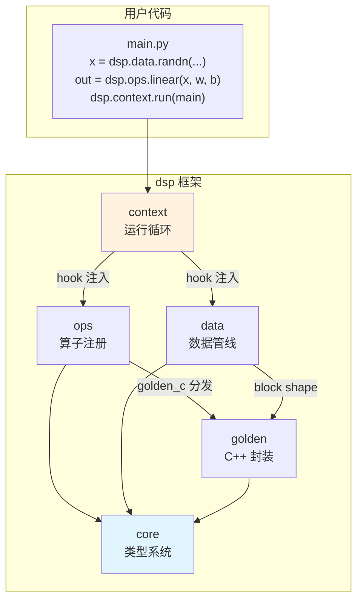
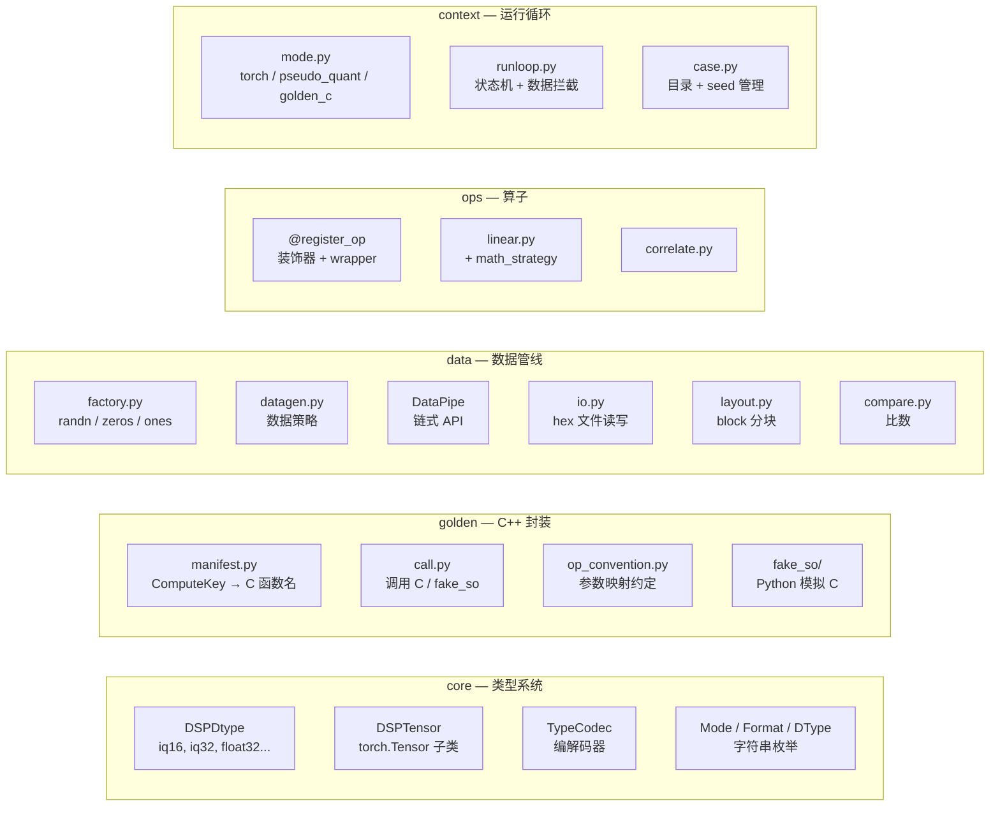
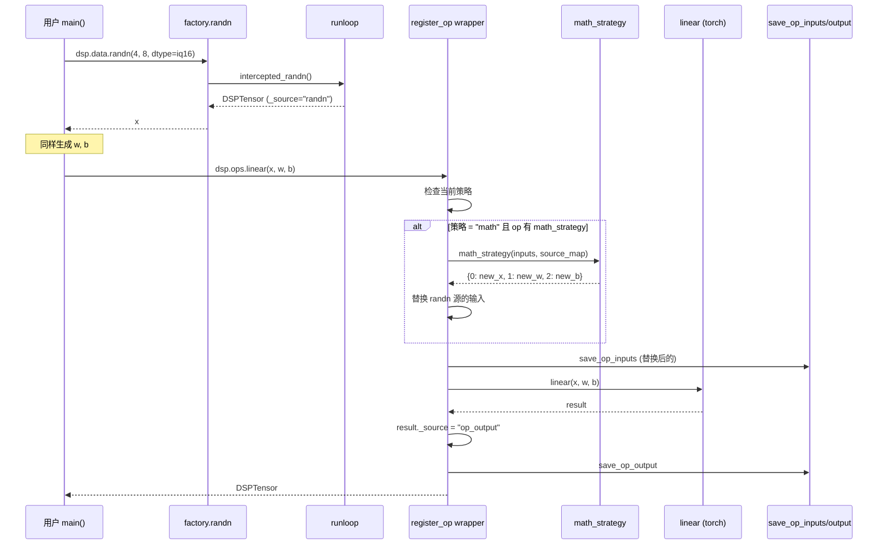
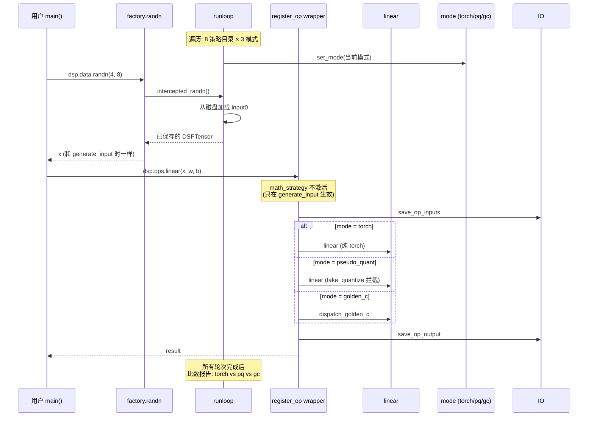
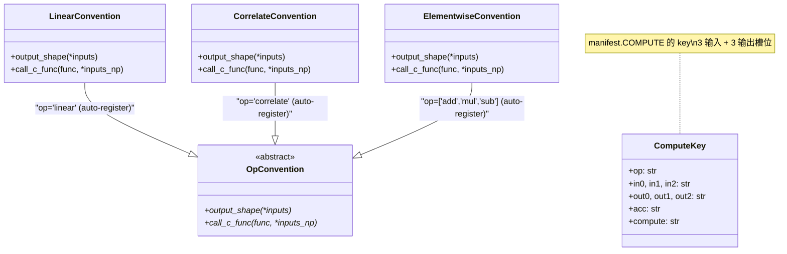
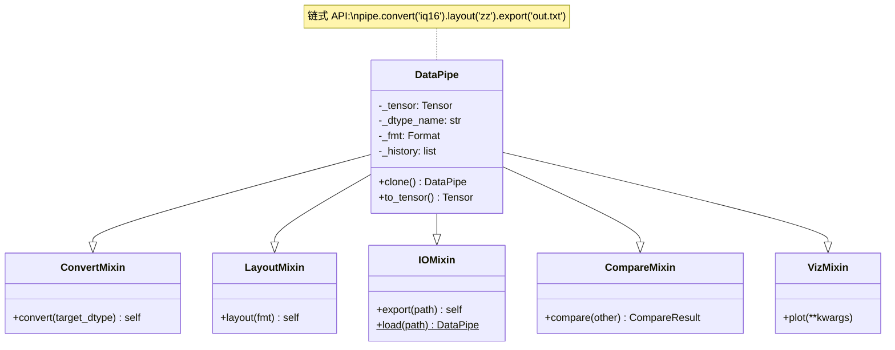
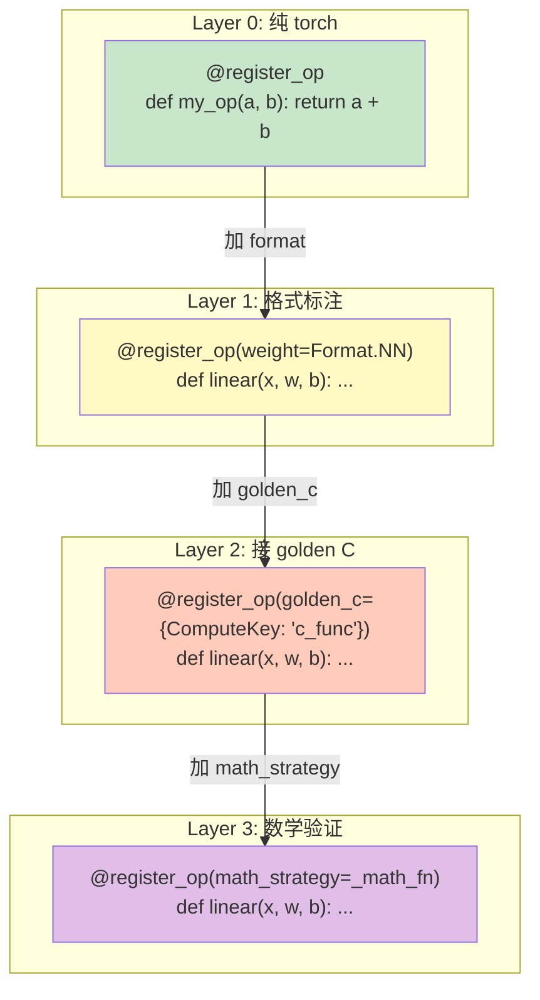
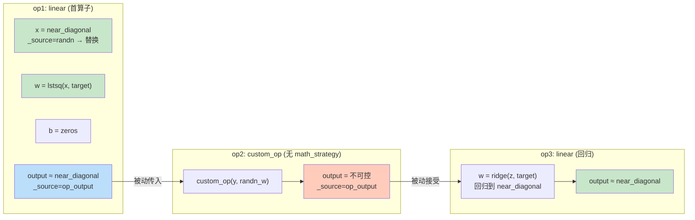
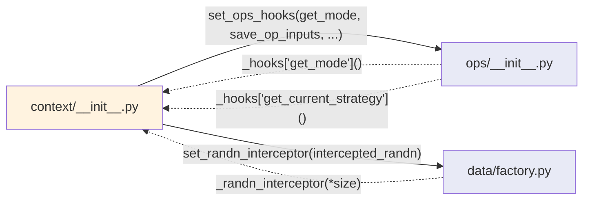

# dsp-core 架构设计文档

> 渐进式阅读：先看 Layer 0（一张图），需要时再深入后续层。

---

## Layer 0: 一张图看全貌



**依赖方向严格单向：** `core → golden → data → ops → context`

import-linter 自动检查，违反即 CI 失败。

---

## Layer 1: 模块职责



---

## Layer 2: 数据流 — generate_input



---

## Layer 3: 数据流 — use_input



---

## Layer 4: 类图

### 4.1 类型系统 (core)

```mermaid
classDiagram
    class DSPDtype {
        +name: str
        +torch_dtype: torch.dtype
        +bits: int
        +is_complex: bool
    }

    class DSPTensor {
        +_dsp_dtype: DSPDtype
        +_source: str  "randn|op_output|None"
        +create(data, dsp_dtype)$ DSPTensor
        +torch() Tensor
        +to_dsp(target) DSPTensor
        +fake_quantize() DSPTensor
        +dsp_dtype: DSPDtype
    }

    class TypeCodec {
        <<abstract>>
        +to_float(data)*
        +from_float(data)*
        +fake_quantize(data)*
    }

    class GoldenCCodec {
        +to_float(data)
        +from_float(data)
        +fake_quantize(data)
    }

    class IQ16Codec
    class IQ32Codec

    DSPTensor --> DSPDtype : _dsp_dtype
    DSPTensor --|> "torch.Tensor" : IS-A
    GoldenCCodec --|> TypeCodec
    IQ16Codec --|> GoldenCCodec : "dtype=iq16 (auto-register)"
    IQ32Codec --|> GoldenCCodec : "dtype=iq32 (auto-register)"
```

### 4.2 Golden C 封装



### 4.3 数据管线 (data)



---

## Layer 5: 算子注册 — 渐进式四层



---

## Layer 6: Math Strategy 链式回归



**核心思想：** linear/matmul 天然具备"投影"能力，利用 lstsq/ridge 把累积误差收回目标 pattern。

---

## Layer 7: Hook 注入 — 解除循环依赖



**实线 = import 时注入**（module load 阶段）
**虚线 = 运行时回调**（通过注入的函数指针）

ops 和 data 永远不 import context，避免循环依赖。import-linter 强制保证。

---

## 附录: 文件清单

| 模块 | 文件 | 一句话 |
|------|------|--------|
| core | `dtype.py` | DSPDtype 定义 + 注册表 |
| core | `tensor.py` | DSPTensor (torch.Tensor 子类 + _dsp_dtype + _source) |
| core | `codec.py` | TypeCodec / GoldenCCodec + __init_subclass__ 自动注册 |
| core | `enums.py` | Mode / Format / RunMode / DType 枚举 |
| core | `errors.py` | 异常层级 + 修复提示 |
| golden | `manifest.py` | TYPES / CONVERT / COMPUTE 三张表 |
| golden | `call.py` | convert() / compute() / is_available() |
| golden | `dispatch.py` | dispatch_golden_c() — 桥接 ops → call |
| golden | `op_convention.py` | OpConvention + __init_subclass__ 自动注册 |
| golden | `fake_so/` | Python 模拟 C 函数（开发用） |
| data | `factory.py` | randn / zeros / ones (打 _source 标记) |
| data | `datagen.py` | DataStrategy + generate_by_strategy |
| data | `pipe.py` | DataPipe (Mixin 组合) |
| data | `convert.py` | ConvertMixin (调 golden.convert) |
| data | `layout.py` | LayoutMixin (block 分块) |
| data | `io.py` | IOMixin (hex 文件) |
| data | `compare.py` | CompareMixin + CompareResult |
| data | `report.py` | 跨模式比数报告 |
| data | `viz.py` | VizMixin (matplotlib) |
| ops | `__init__.py` | @register_op + dispatch + hook 注入 |
| ops | `linear.py` | linear + _linear_math_strategy |
| ops | `correlate.py` | correlate (互相关) |
| context | `__init__.py` | run() + hook 注入 + compute config |
| context | `mode.py` | PseudoQuantMode / GoldenCMode |
| context | `runloop.py` | 状态机 + intercepted_randn + 出数 |
| context | `case.py` | 目录命名 + seed 提取 |
| — | `config.py` | 全局配置单例 |
