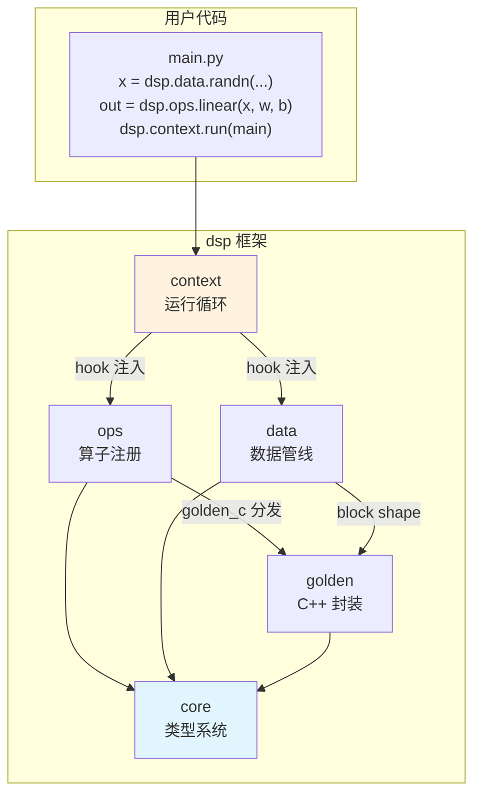
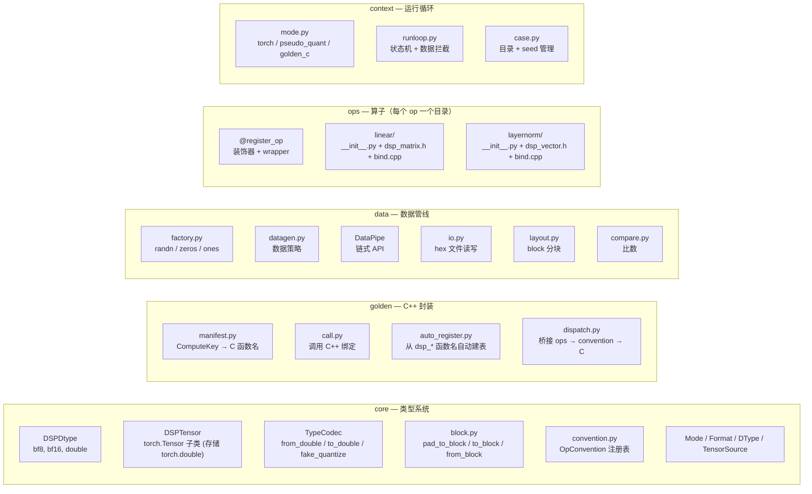
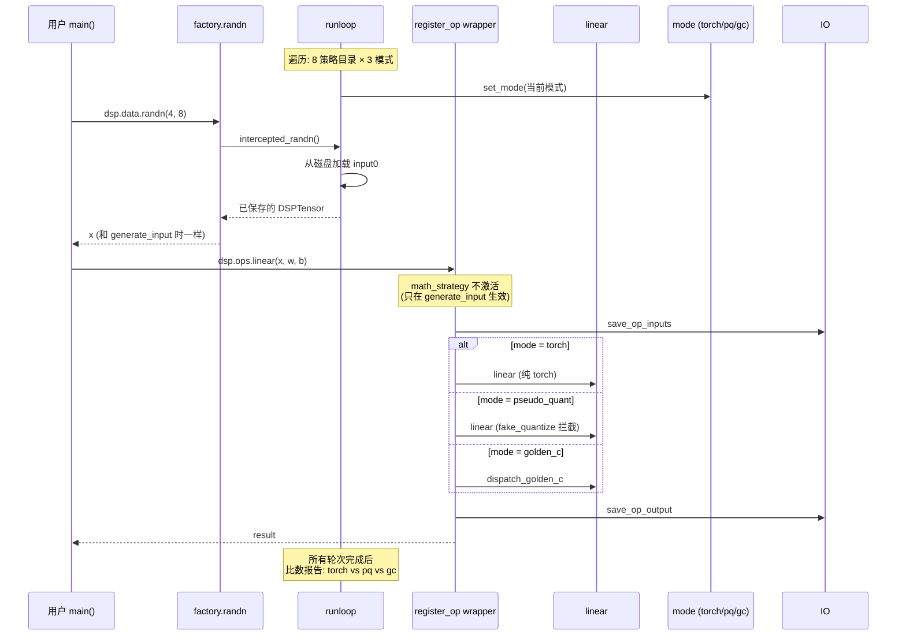
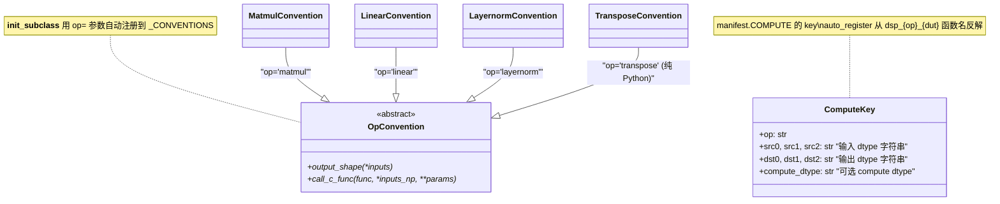
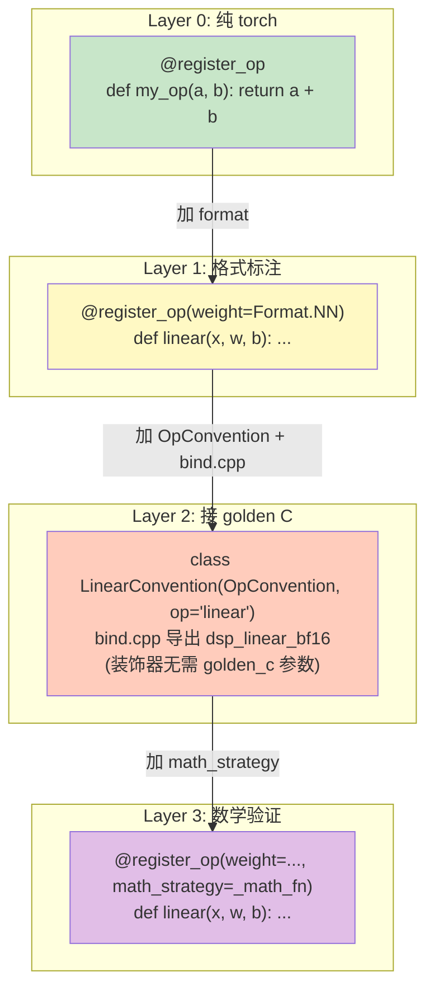
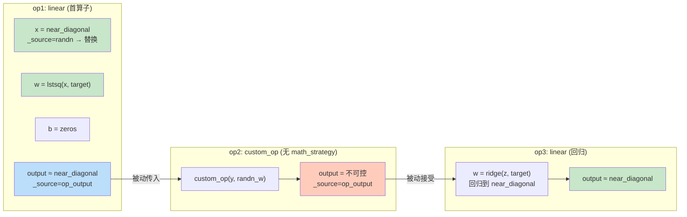
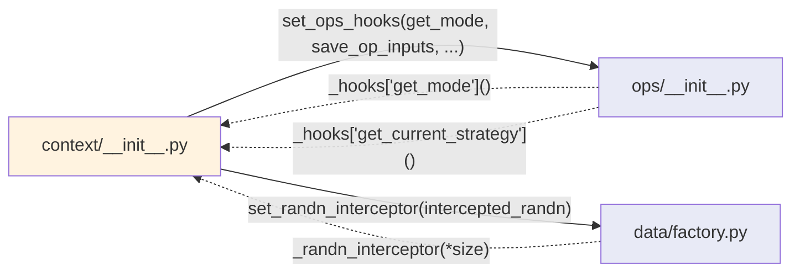

# dsp-core 架构设计文档

> 渐进式阅读：先看 Layer 0（一张图），需要时再深入后续层。

---

## Layer 0: 一张图看全貌



**依赖方向严格单向：** `core → golden → data → ops → context`

import-linter 自动检查，违反即 CI 失败。

---

## Layer 1: 模块职责



---

## Layer 2: 数据流 — generate_input


---

## Layer 3: 数据流 — use_input



---

## Layer 4: 类图

### 4.1 类型系统 (core)

```mermaid
classDiagram
    class DSPDtype {
        +name: str                "bf8 | bf16 | double"
        +torch_dtype: torch.dtype "语义标签，非存储类型"
        +subblock_size: int       "128-bit 寄存器内的元素数"
    }

    class DSPTensor {
        +_dsp_dtype: DSPDtype
        +_source: TensorSource    "RANDN | RANDN_QUANTIZED | OP_OUTPUT"
        +create(data, dsp_dtype)$ DSPTensor
        +torch() Tensor
        +fake_quantize() DSPTensor
        +dsp_dtype: DSPDtype
    }

    class TypeCodec {
        <<abstract>>
        +to_double(raw, dtype)*
        +from_double(t, dtype)*
        +fake_quantize(t, dtype)*
    }

    class GoldenCCodec {
        +to_double(raw, dtype)    "走 golden C convert"
        +from_double(t, dtype)    "走 golden C convert"
        +fake_quantize(t, dtype)  "按 subblock_size 对齐后做 round trip"
    }

    class PassthroughCodec {
        +to_double(raw, dtype)    "raw.double()"
        +from_double(t, dtype)    "t.to(torch_dtype)"
    }

    DSPTensor --> DSPDtype : _dsp_dtype
    DSPTensor --|> "torch.Tensor" : IS-A（存储始终 torch.double）
    GoldenCCodec --|> TypeCodec
    PassthroughCodec --|> TypeCodec

    note for GoldenCCodec "bf8 / bf16 都复用同一个 _golden_codec 实例\n不再为每个 dtype 造子类"
```

### 4.2 Golden C 封装



### 4.3 数据管线 (data)


---

## Layer 5: 算子注册 — 渐进式四层



---

## Layer 6: Math Strategy 链式回归



**核心思想：** linear/matmul 天然具备"投影"能力，利用 lstsq/ridge 把累积误差收回目标 pattern。

---

## Layer 7: Hook 注入 — 解除循环依赖



**实线 = import 时注入**（module load 阶段）
**虚线 = 运行时回调**（通过注入的函数指针）

ops 和 data 永远不 import context，避免循环依赖。import-linter 强制保证。

---

## 附录: 文件清单

| 模块 | 文件 | 一句话 |
|------|------|--------|
| core | `dtype.py` | DType 枚举 + DSPDtype（bf8/bf16/double）+ TypeCodec + GoldenCCodec + PassthroughCodec |
| core | `tensor.py` | DSPTensor（torch.Tensor 子类 + _dsp_dtype + _source，存储始终 torch.double） |
| core | `block.py` | BlockShape / pad_dim / pad_to_block / to_block / from_block / format_to_dut |
| core | `convention.py` | OpConvention 基类 + __init_subclass__ 自动注册到 _CONVENTIONS |
| core | `enums.py` | Mode / Format / RunMode / TensorSource |
| core | `errors.py` | 异常层级 + 修复提示 |
| golden | `bind_helpers.h` | to_dut / from_dut / num_blocks 模板（pybind11 桥接） |
| golden | `bindings.cpp` | pybind11 顶层入口（编译为 _raw_bindings.so） |
| golden | `manifest.py` | CONVERT / COMPUTE 表 + ComputeKey NamedTuple |
| golden | `call.py` | convert() / compute() / is_available() |
| golden | `auto_register.py` | 从 _raw_bindings 的 dsp_* 函数名反解并填 manifest |
| golden | `dispatch.py` | dispatch_golden_c() — 桥接 ops → require_convention → call |
| data | `factory.py` | randn / zeros / ones / tensor（一律 torch.double 存储，打 _source 标记） |
| data | `datagen.py` | DataStrategy + generate_by_strategy（math / random / ...） |
| data | `pipe.py` | DataPipe（Mixin 组合：layout + io + compare + viz） |
| data | `layout.py` | LayoutMixin（ND ↔ ZZ / NN） |
| data | `io.py` | IOMixin（hex txt 读写，按文件名 dtype 读写 double/bf16 bits） |
| data | `compare.py` | CompareMixin + CompareResult（QSNR / cosine / max_diff） |
| data | `report.py` | 跨模式比数报告 |
| data | `viz.py` | VizMixin（plotly HTML 报告） |
| ops | `__init__.py` | _auto_import_ops: pkgutil 自动扫描 ops/ 下子目录 |
| ops | `__init__.pyi` | Pylance 类型提示 stub |
| ops | `_convert/` | dsp_convert.h + bind.cpp（double ↔ DUT 类型转换） |
| ops | `linear/` | __init__.py（LinearConvention + math_strategy）+ dsp_matrix.h + bind.cpp |
| ops | `layernorm/` | __init__.py + dsp_vector.h + bind.cpp |
| ops | `transpose/` | __init__.py（纯 Python OpConvention，无 C） |
| context | `__init__.py` | run() + hook 注入（set_ops_hooks + set_randn_interceptor） |
| context | `mode.py` | torch / pseudo_quant / golden_c 的 dispatch mode |
| context | `runloop.py` | 状态机 + intercepted_randn + save_op_inputs/output + load_op_inputs |
| context | `case.py` | 目录命名 + seed 提取 |
